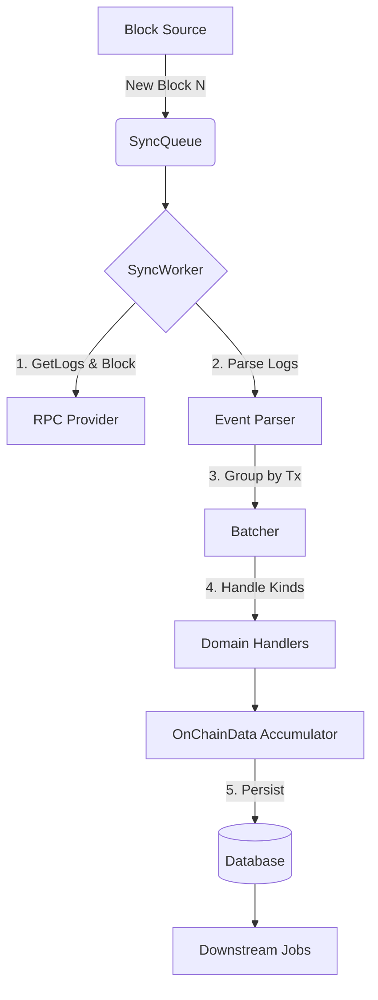

# Sync Pipeline Specification

## Overview

The Sync Pipeline is the heart of the indexer. It transforms raw blockchain data into structured domain entities. It supports both **Realtime** (head of chain) and **Backfill** (historical) modes using a unified logic path.

## 1. Block Detection & Scheduling

### Components

- **BlockPoller:** Periodically queries `eth_blockNumber`.
- **WebSocketListener:** Subscribes to `newHeads`.
- **Scheduler-Worker:** Single authority that merges heads from WS + poller, de-duplicates, and fills gaps.
- **BackfillAPI:** Accepts manual ranges via Admin API.

### Logic

1.  **Realtime:**
    - Detect new block height `N`.
    - Scheduler-worker publishes `SyncJob(block: N)` to `realtime-queue`.
    - De-duplicate at queue level (e.g., NATS `Nats-Msg-Id = chainId:blockN`) and again at persistence level.
    - _Optimization:_ Cache `eth_getBlock` result immediately (in-memory or Redis) to save RPC calls for workers.
2.  **Polling as authority:**
    - Poller periodically fetches head and calls scheduler-worker.
    - If WS misses blocks, scheduler-worker gap-fills `[lastScheduled+1, head]`.
    - If WS is ahead, poller still confirms and fills any gaps.
3.  **Backfill:**
    - Split range `[Start, End]` into batches (e.g., 50 blocks).
    - Publish `BackfillJob(from: A, to: B)` to `backfill-queue`.

## 2. Sync Execution (The "Sync Loop")

**Job Handler:** `SyncBlockUseCase`

### Step 1: Fetch Data

- **Input:** `fromBlock`, `toBlock`.
- **Action:**
    - Call `RpcProvider.getLogs(filter)`. Filter includes all topics of interest (ERC721 Transfer, Orders, etc.).
    - Call `RpcProvider.getBlock(number)` for timestamps and hashes.
    - Call `RpcProvider.getTransaction(hash)` for input data (calldata).
- **Optimization:**
    - _Realtime:_ Check Redis cache for block/tx data first.
    - _Backfill:_ Use specific "Backfill RPC" provider if configured (lower rate limits, higher latency ok).

### Step 2: Event Parsing

- **Input:** Raw Logs.
- **Action:**
    - Iterate over logs.
    - Match topics against known `EventDefinitions` (e.g., `Transfer(from, to, tokenId)`).
    - Decode log data using ABIs.
    - **Output:** List of `EnhancedEvent` objects containing:
        - `Kind` (e.g., "erc721", "seaport").
        - `BaseParams` (txHash, logIndex, blockHash).
        - `DecodedParams` (from, to, amount, price).

### Step 3: Batching

- Group `EnhancedEvents` by **Transaction**.
- This ensures atomic processing of all events within a single tx (crucial for accurate balance updates and order fills).

### Step 4: Domain Handling (Fan-Out)

- **Input:** Batched Events.
- **Action:** Pass events to specific **Domain Handlers**:
    - **ERC721/1155 Handler:** Extracts transfers, mints.
    - **Seaport/Blur Handler:** Extracts order fills, cancellations.
    - **Payment Handler:** Extracts ERC20 transfers (payment context).
- **Result:** Accumulate state changes into a unified `OnChainData` structure (see Data Structures spec).

### Step 5: Persistence

- **Action:** Atomic DB Write.
- **Strategy:**
    - _Realtime:_ Write directly to tables (`nft_transfer_events`, `orders`, `fills`).
    - _Backfill (High Load):_ Use **Write Buffers**. Push data to a `write-buffer-queue`. A dedicated serial worker drains this queue to Postgres to prevent deadlocks (locking `nft_balances` is expensive).
    - _Focus Mode:_ If configured, filter `OnChainData` to only include the target collection _before_ writing.

## 3. Post-Processing Hooks

After successful persistence, the pipeline triggers downstream jobs:

1.  **Block Check:** Schedule a re-check of this block in X minutes (to detect reorgs).
2.  **Transaction Cache:** (Realtime only) Save full transaction objects to Redis for X minutes (used by other jobs to avoid RPC re-fetch).
3.  **Gap Check:** Check if the previous block `N-1` is missing in DB. If yes, schedule sync for `N-1`.
4.  **No-Transfer Retry:** If block had 0 logs but contained txs, re-queue with delay (handling eventual consistency of RPC nodes).

## Diagram

