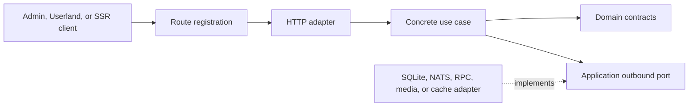

# Backend API and Application Architecture

The backend exposes local read models and operator actions over Fastify. It is an
inbound adapter around concrete application use cases; it is not a second
indexer, a trading bot, or a centralized ArtGod service.

## Dependency Flow

The dependency rules are strict:

- `backend/src/http-routes.ts` registers methods and paths and attaches
  route-specific deployment-scope guards and observability metadata.
- `backend/src/http/handlers/*` owns request DTO parsing and response mapping.
- `backend/src/application/use-cases/*` owns business actions and orchestration.
- Use cases receive constructor-injected application ports. Some current
  bootstrap and trading ports are shared by several related use cases, while
  use-case input and output types do not expose Fastify, SQLite rows, NATS
  envelopes, or SDK payloads.
- `backend/src/infra/*` implements database, queue, RPC, cache, media, and trading
  ports.
- `backend/src/index.ts` wires concrete outbound adapters and use cases.
  `backend/src/http-app.ts` constructs the inbound HTTP adapters, common hooks,
  and route registry.

See the [backend request-flow diagram](../diagrams/07-backend-hexagonal-request-flow.md)
for the runtime call flow and layer boundaries together.

## Composition Order

`backend/src/index.ts` keeps construction explicit:

1. Load typed configuration and open the local SQLite database.
2. Create observability, chain/RPC, queue, read-model, cache, media, collection,
   bootstrap, and trading adapters one by one.
3. Construct concrete use-case classes with their application ports.
4. Pass each use case to `createApiApp()`.
5. In `backend/src/http-app.ts`, construct the route-specific HTTP adapters,
   register common hooks and API routes, then add cached-media and optional
   Userland static routes.
6. Start cache lifecycles around Fastify listener startup and stop them when the
   app closes.

Grouped dependency containers are intentionally absent. A new route should make
its dependency path visible rather than expanding a general-purpose object.

## API Subjects

The current route set covers:

- liveness and dependency health;
- default-chain and sanitized runtime configuration reads;
- ENS/address owner resolution;
- collection, token, holder, trait, activity, preview, tokenURI, and blockspace
  reads;
- collection bootstrap probing, creation, status, durable run inspection,
  pause/resume, and terminal retry;
- manual blockspace backfill and OpenSea collection controls;
- collection customization;
- bidding bid books, job target lookup, exact-token/batch/trait/collection jobs,
  price tiers, collection settings, and archive/reapply actions.

The machine-readable method, path, parameter, and response contract is
[OpenAPI](openapi.yaml). `yarn check:docs` compares its non-wildcard method/path
set to route registration and the shared route-template owners.

## Read Models and Writes

Most collection, token, activity, holder, trait, bid-book, and blockspace
presentation comes from materialized local state. Specific endpoints also make
current dependency reads: owner resolution and tokenURI use RPC, bootstrap
probes inspect contracts or OpenSea, and runtime health checks SQLite and NATS.
The backend may compose or cache reads, but it does not replay chain history in
an HTTP request.

Mutation workflows include:

- a use case performs a local transactional state change through an application
  repository port;
- a use case persists command intent in SQLite and publishes a NATS wake-up;
  the trading recovery scan handles a missed wake-up;
- a use case validates input, creates a durable bootstrap run, and lets an
  indexer runtime claim the work;
- manual historical backfill validates/splits a range and publishes its chunks
  directly, without a durable parent run. Its partial-publication and recovery
  limits are documented in [sync](../indexer/04-sync-pipeline.md#large-manual-backfills).

HTTP handlers do not open transactions or call concrete repositories directly.
Cross-row atomicity belongs behind the use case's outbound port.

## Query Caching

The query-cache port supports `disabled` and bounded in-memory modes. The public
single-collection composition can additionally maintain:

- a periodically refreshed collection-detail snapshot;
- bounded token-preview entries with stale-while-refresh behavior and warmup
  concurrency;
- a periodically refreshed collection-scoped blockspace snapshot.

Cache values are derived from local read models. A cache miss or refresh does
not change domain state. Debug response headers are emitted only when a query
cache records an event for the request, and query-cache response logging drops
query values while retaining only allowlisted query keys.

## Error Boundary

HTTP adapters map known validation, conflict, missing-record, and unavailable
conditions to stable response shapes. Unexpected details stay in structured
logs and traces. User-facing callers should display the concise recovery action,
not raw database, transport, RPC, or marketplace errors.

## Adding a Backend Capability

1. Define or update the use-case input, output, method, and narrow outbound
   contracts in the owning use-case or subject boundary.
2. Implement or extend a concrete outbound adapter.
3. Wire the adapter and use case explicitly in `backend/src/index.ts`.
4. Add a transport mapper in `backend/src/http/handlers/<subject>/`.
5. Register the method/path in `backend/src/http-routes.ts`.
6. Update [OpenAPI](openapi.yaml), domain prose, and any affected diagrams.
7. Add use-case unit tests, HTTP adapter tests, and a vertical integration test
   when real adapter interaction is the behavior under test.

## Current Limits

- The OpenAPI document describes registered non-wildcard HTTP routes, not the
  wildcard API `OPTIONS` handler, cached media, or built frontend static-file
  paths.
- Read-only public hosting is a fixed configured collection view, not a general
  multi-tenant API. See [deployment modes](02-http-security-and-deployment-modes.md).
- Loopback browser mutation protection is not proof that the browser belongs to
  the supervised desktop runtime. See [local runtime trust](../desktop/07-local-runtime-trust.md).
