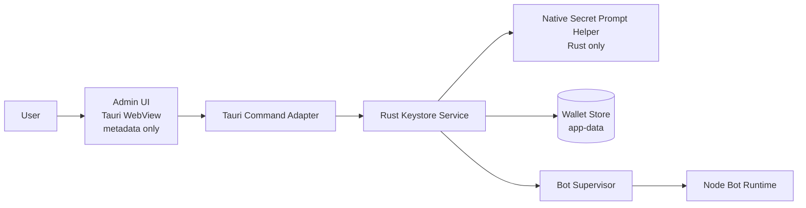
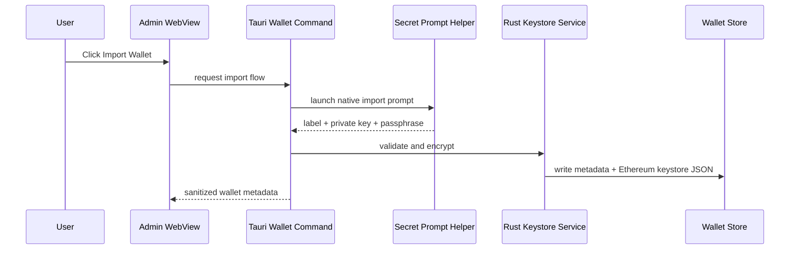
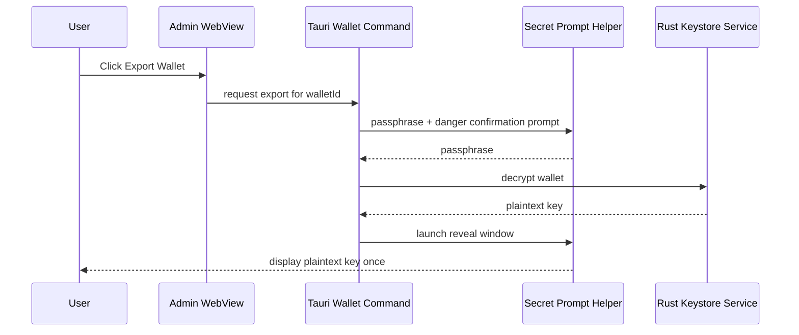
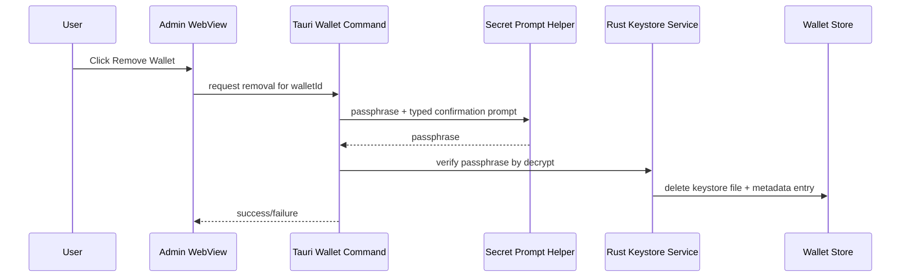
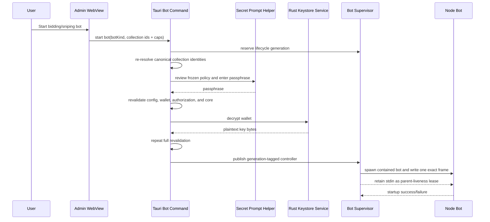

# Wallet Keystore and Bot Unlock Model

This document defines the canonical desktop wallet custody model for ArtGod.
It covers private-key import/export/remove, encrypted local keystore storage,
native secret-entry flows, and the single-frame secret handoff and parent-liveness
channel used by trading bot runtimes.

This is intentionally stricter than a typical desktop wallet UX.

The design follows Foundry-like operational semantics:

- import existing private keys only
- keep keys encrypted at rest
- prompt for the passphrase each time a wallet is unlocked
- keep decrypted keys out of normal app state
- treat process restart as a fresh lock boundary

The storage and crypto path should align with Foundry/Paradigm wherever practical:

- standard Ethereum keystore JSON files at rest
- the source-pinned `eth-keystore` decrypt primitive with immediate zeroizing ownership of returned plaintext
- Alloy signer validation and address derivation after decrypt
- a source-pinned `eth-keystore` writer with explicit ArtGod-owned scrypt work parameters
- the same bounded unlock behavior at the desktop core-process boundary

ArtGod still keeps its own wallet metadata index for UI and bot assignment state.

Related docs:

- `docs/ui/00-user-perspective-and-language.md`
- `docs/ui/01-interaction-guidelines.md`
- `docs/desktop/01-tauri-build-and-runtime.md`
- `docs/desktop/02-runtime-registry-maintenance.md`
- `docs/diagrams/00-desktop-components.md`
- `docs/trading/01-bidding-runtime-and-jobs.md`
- `docs/progress/desktop/02-local-runtime-identity-and-browser-trust.md`
- `docs/progress/desktop/01-wallet-keystore-implementation-plan.md`

## Decision Summary

ArtGod will use a hybrid desktop model:

- wallet listing, labels, addresses, and bot assignment live in the privileged admin UI
- raw private-key entry, passphrase entry, and plaintext export display do not live in the WebView
- those secret-entry flows are owned by Rust via a dedicated native secret-prompt helper sidecar
- encrypted wallet storage is owned by Rust and kept in desktop app-data as standard Ethereum keystore JSON files, outside backend/indexer SQLite
- trading bot runtimes receive decrypted key material only once at startup in one
  framed stdin write; Rust retains the pipe afterward only as a parent-liveness
  lease
- bidding starts also receive one immutable native-reviewed collection mandate
  in that same frame
- one composition-owned coordinator permits only one native wallet prompt across
  import, export, remove, and bot unlock flows at a time
- any bot restart requires a fresh passphrase prompt

This design explicitly rejects all session unlock caching.

## Alignment With Foundry, Alloy, and Geth

ArtGod should not invent a custom wallet cryptography format unless there is a compelling security reason that cannot be achieved with established Ethereum V3 implementations and primitives.

Current design decision:

- use standard Ethereum keystore JSON for secret storage
- use the source-pinned `eth-keystore` primitive for decrypt operations and immediately wrap its returned plaintext allocation in `Zeroizing`
- use Alloy for private-key validation and address derivation
- use the same underlying `eth-keystore` construction through a narrow, source-pinned explicit-parameter writer
- own the production scrypt work policy in the source-pinned writer rather than in Admin or environment configuration
- keep an ArtGod-owned metadata index for label, assignment, and status

This keeps ArtGod aligned with the standard Ethereum V3 format and Foundry-compatible decrypt path without inheriting the upstream writer's weak default work factor.

### Direct Implementation Comparison

The remediation was reviewed directly against exact upstream sources on 2026-07-12:

- Foundry [`v1.7.1` at `4072e48705af9d93e3c0f6e29e93b5e9a40caed8`](https://github.com/foundry-rs/foundry/tree/4072e48705af9d93e3c0f6e29e93b5e9a40caed8), released 2026-05-08
- Geth [`v1.17.4` at `36a7dc72e96b3f42846be925cfeb2fad18489917`](https://github.com/ethereum/go-ethereum/tree/36a7dc72e96b3f42846be925cfeb2fad18489917), released 2026-06-22

Supplemental checks against Foundry master
[`61a1bb421e4aa5c4ce38da57f5e9064b0aff3330`](https://github.com/foundry-rs/foundry/tree/61a1bb421e4aa5c4ce38da57f5e9064b0aff3330)
and Geth master
[`3ab52d837d7baec73b53cdfbdb3bfb5fee6a81fe`](https://github.com/ethereum/go-ethereum/tree/3ab52d837d7baec73b53cdfbdb3bfb5fee6a81fe)
confirmed the same relevant behavior.

Foundry uses the same Ethereum V3/Alloy read path but still writes the weak
`eth-keystore` default. Geth does not patch scrypt: it owns a parameterized
keystore wrapper around the unmodified Go scrypt implementation and uses
`N=2^18`, `r=8`, `p=1`, `dklen=32` as its standard profile. ArtGod likewise
keeps the scrypt primitive unchanged; the source-pinned patch restores the
missing parameter control in the Rust wrapper and enforces the Geth-standard
profile on every ArtGod writer path.

The detailed source, dependency, and before/after inventory is recorded in the
[`eth-keystore` patch record](../../src-tauri/vendor/eth-keystore/ARTGOD-PATCH.md).

## Scope

This specification covers:

- importing one or more existing EVM private keys into the desktop app
- exporting a stored private key back to plaintext on explicit operator request
- removing a stored wallet
- assigning wallets to `bidding` and `sniping` bot runtimes
- decrypting a wallet only for explicit export or bot startup
- keeping wallet storage and runtime wiring local-only

This specification does not cover:

- wallet generation
- mnemonic generation or mnemonic import
- browser userland wallet management
- backend HTTP wallet APIs
- remote custody or synchronized cloud state
- unattended bot restart with cached secrets
- session unlock TTLs, temporary unlock windows, or background auto-unlock

## Core Security Invariants

These are hard rules, not suggestions.

1. Raw private keys must never enter the unprivileged browser userland UI.
2. Raw private keys must never be stored in backend/indexer SQLite.
3. Raw private keys must never be written to `.env`, process env, CLI args, or logs.
4. Raw private keys must never be sent over backend HTTP routes.
5. Raw private keys must never be stored in browser storage (`localStorage`, `sessionStorage`, IndexedDB).
6. Raw private keys must never be rendered inside the Tauri WebView.
7. Raw private keys may exist only in:
   : the native secret prompt
   : Rust keystore service memory during import/export/unlock
   : bot runtime memory after the single-frame startup handoff
8. Every bot start and every bot restart is a fresh unlock event.
9. There is no session unlock cache, no unlock TTL, and no silent reuse after restart.
10. If decryption or prompt flow fails, the bot remains stopped and locked.
11. The bot recipient is a fixed bundled Node/loader/artifact launch snapshot
    resolved before the prompt; Admin configuration cannot redirect it.
12. Release builds verify the exact key-bearing runtime code and dependency
    file set against hashes embedded in the Rust desktop executable before
    prompting.
13. Key-bearing Node processes clear the parent environment and receive only
    the frozen, Rust-resolved ArtGod child-process map.
14. Userland bidding mutations are proposals, not wallet authority. Every bidding start requires a native-reviewed mandate resolved by Rust from canonical live collection records with enabled or paused bidding jobs.
15. Without relying on HTTP middleware or a prior SQLite approval flag, the bidding signer must reject offers outside the approved chain, ArtGod collection ID, contract address, OpenSea slug, maximum WETH for any one NFT, and fixed per-offer quantity.
16. Native wallet prompts are serialized by one composition-owned coordinator;
    overlapping requests fail closed instead of opening independently.
17. Every bot start owns one monotonic lifecycle generation from before dependency
    stabilization through prompt, decrypt, process publication, and secret
    handoff. Stop or core shutdown cancels that generation and prevents stale work
    from becoming active.
18. A bot process must not outlive the desktop parent. The retained stdin lease
    provides the portable liveness boundary, reinforced by platform process
    containment where available.
19. Production prompt responses must follow one bounded stdin request and native
    interaction. Environment variables cannot submit a helper response.
20. The Tauri process and native prompt helper must install supported current-
    process dump hardening before accepting wallet secrets.
21. Sensitive Unix child preparation must set both core limits to zero, and the
    key-bearing Node command must include `--disable-sigusr1` exactly once.

## Threat Model

This design is intended to reduce exposure to:

- accidental secret exposure through the Admin DOM, frontend state, logs,
  environment variables, command-line arguments, SQLite, or ordinary crash
  files
- read-only local filesystem disclosure of encrypted keystore material at rest
- untrusted Userland browser sessions, extensions, or raw loopback clients that
  invoke bidding-job mutation routes
- malformed, stale, duplicated, wrong-chain, or out-of-policy placement jobs
- policy or config drift between native review, decryption, secret handoff,
  Node startup, and active runtime state
- OpenSea SDK behavior that requests signing authority outside the restricted
  offer and offchain-cancellation surface
- parent shutdown, process death, task cancellation, or failed secret handoff
  leaving a key-bearing child process alive
- a dry-run path accidentally reaching a live signing operation
- inherited Node environment variables reopening code injection or inspector
  startup

Raw secret entry and reveal remain outside the WebView, and Tauri command
results never carry raw secrets. That is an exposure-reduction design fact, not
a claim that this boundary defeats arbitrary code execution in the privileged
Admin WebView or Tauri core.

This design does not claim to protect against:

- arbitrary code execution in the privileged Admin WebView or Tauri core
- a malicious or dishonest operator-selected RPC; public-alpha operation
  assumes the operator selects truthful endpoints
- direct writes to ArtGod SQLite, app-data, keystore files, or runtime files;
  those are host-compromise capabilities in this local-only model
- same-user debugger, `ptrace`, or process-memory access
- aggregate strategy abuse within an authorized collection while each offer
  remains inside the reviewed per-NFT price and quantity caps
- continued exposure from existing orders or allowance after a bot stops, a
  process dies, or a mandate generation ends; ArtGod does not automatically
  cancel those orders or revoke that allowance
- protection of more WETH or ETH than the operator intentionally funds into
  the dedicated bidding wallet
- a fully compromised machine
- root/admin-level local malware
- kernel compromise
- hardware keyloggers
- OS screenshots or screen recording outside app control

The objective is to make the wallet boundary materially narrower and more auditable, not to solve full host compromise.

The current bounded residual risk is explicit: compromised Userland code or a
raw loopback client may create, revise, pause, or archive any number of jobs for
a collection already granted in the current native mandate. Placement remains
bounded per offer by the approved chain, ArtGod collection ID, contract address,
OpenSea slug, maximum WETH for any one NFT, and fixed per-offer quantity; there
is no aggregate strategy budget or reservation boundary. Exact-token membership
in the displayed ArtGod token scope is currently enforced by the canonical
backend mutation paths, not independently by the signer; independent signer
enforcement is deferred. Pause/archive mutations may also cause offchain
cancellation of tracked offers because cancellation intentionally remains
available outside the placement mandate. That availability and aggregate
strategy risk is accepted for the current local alpha. No browser-readable
bearer/session credential is introduced over loopback HTTP.

Existing signed OpenSea orders and the onchain conduit allowance survive bot
stop, process death, and mandate-generation end. ArtGod does not promise
automatic order cancellation or allowance revocation. The operational
assumption is a dedicated bidding wallet funded only with the WETH and ETH the
operator is prepared to expose to alpha automation risk.

## Why Hybrid Instead of WebView-Only

Even with a strict CSP and a minimal admin bundle, a WebView-only design still leaves the highest-value secret-entry path inside:

- frontend dependencies
- DOM/input handling
- Tauri JS bridge payloads
- general-purpose app state

That is the wrong place to keep the most sensitive flow if the project is deliberately aiming for paranoid custody.

The hybrid model keeps:

- WebView for non-secret control-plane UX
- Rust-only prompt path for raw secret entry and reveal

This reduces the number of layers that can mishandle a raw private key.

## High-Level Architecture



Boundary rules:

- WebView can request wallet operations, but it never receives raw private-key material.
- Secret prompt helper is the only UI surface allowed to capture or reveal raw secrets.
- Keystore service is the only component allowed to encrypt/decrypt wallet files.
- Bot supervisor is the only component allowed to hand decrypted key material to Node bots.

## Component and Process Ownership

ArtGod uses three distinct component roles for wallet and bot startup flows.

### 1) Tauri Wallet/Bot Commands

These are part of the main Tauri core process.

Responsibilities:

- receive admin UI requests over Tauri IPC
- map transport DTOs into use-case input
- call the Rust keystore service or bot supervisor
- return sanitized status back to the WebView

These commands are inbound adapters only.
They are analogous to the existing runtime commands in `src-tauri/src/lib.rs`.

Desktop composition creates the wallet command state first and derives bot
command state from it. Both therefore share the same prompt adapter and prompt
coordinator; importing, exporting, removing, and unlocking cannot open
independent native wallet prompts concurrently.

### 2) Rust Keystore Service

This is also part of the main Tauri core process.

Responsibilities:

- list wallets from metadata
- import wallets
- export wallets
- remove wallets
- unlock a wallet for bot startup
- call the source-pinned `eth-keystore` implementation for encryption and decryption, then use Alloy to validate recovered key material
- own all plaintext key handling inside the main app process

This is the core business service for wallet custody inside the desktop app.

### 3) Secret Prompt Helper

This is a separate bundled Rust sidecar process.

Responsibilities:

- collect raw private keys and passphrases through a native UI
- show plaintext export reveal UI
- communicate prompt results back to the main Tauri process over stdio

It does not own keystore files, metadata, or bot supervision.

## Bounded Unlock Behavior

Bounded unlock behavior in ArtGod means:

- the main Tauri core process does not keep a reusable unlocked wallet session
- the prompt helper returns the passphrase only for the current operation
- the Rust keystore service decrypts only for that operation
- the passphrase and decrypted key are dropped from the main Rust process as soon as the operation completes

For import, the bounded operation is:

- collect private key and passphrase
- encrypt and persist keystore
- drop plaintext buffers

For export, the bounded operation is:

- collect passphrase
- decrypt key
- reveal once in the helper
- drop plaintext buffers

For bot startup, the bounded operation is:

- reserve the bot's next lifecycle generation before any asynchronous work
- resolve and freeze the trusted bundled bot recipient before prompting
- collect passphrase
- revalidate core health, runtime config, wallet assignment, and canonical
  bidding authorization after the prompt
- decrypt key
- repeat the same revalidation after decrypt
- publish the generation-tagged controller before releasing its worker to spawn
- attach platform process containment before writing the secret
- send one exact frame over stdin/pipe and retain the now-idle writer as the
  parent-liveness lease
- drop plaintext buffers in the main Rust process

Important:

- the running bot still keeps the key in its own process memory for as long as the bot is active
- bounded unlock applies to the keystore boundary in the main desktop process, not to the live bot runtime

## Runtime Boundary Model

ArtGod desktop should treat the runtime as two groups:

### 1) Core Composition

This is the existing always-on local stack:

- NATS
- backend
- indexer workers

Current fail-fast behavior is appropriate here.

### 2) Trading Bots

These are desktop-managed optional runtimes:

- `bidding`
- `sniping`

Bots must not share the same restart policy as the core composition.

Required behavior:

- a bot failure must not tear down the full core composition
- a bot may be stopped when one of its declared critical dependencies becomes unhealthy
- Stop remains available while a native authorization prompt or startup work is
  pending; it cancels that start generation and waits for the pending operation
  to unwind before completing
- a bot restart must return that bot to a locked state
- a locked bot requires a fresh passphrase prompt before it starts again

This keeps bot custody strict without making the entire desktop stack unusable.

## Wallet Storage Location

Wallet storage must live in desktop app-data under a Rust-owned directory, separate from the shared app database.

Example layout:

```text
<app-data>/
  wallets/
    index.json
    <wallet-id>.json
    <wallet-id>.json
```

Why not backend/indexer SQLite:

- backend and indexer are Node runtimes with broader file/database access
- the admin UI can query Tauri directly, so backend does not need wallet reads
- keeping wallet storage outside shared database reduces accidental coupling and leak surface

## Wallet Metadata Model

`index.json` stores non-secret metadata only.

Suggested fields:

- `walletId`
- `label`
- `address`
- `createdAt`
- `updatedAt`
- `keystoreVersion`
- `storageFormat`
- `assignedBotKinds`
- `status`

Metadata rules:

- address is not treated as secret
- labels are operator-defined and must be unique
- metadata must not include passphrases, ciphertext keys, plaintext key bytes, or recovery data
- metadata must be enough for the admin UI to list and manage wallets without querying Node services

## Ethereum Keystore File Format

ArtGod should store private keys using the standard Ethereum keystore JSON format rather than a custom sealed file format.

Reason:

- this interoperates with Foundry's Ethereum V3 read path
- this lets ArtGod reuse the Ethereum V3 construction used by Alloy, Foundry, and Geth
- this avoids custom cryptography design and maintenance work
- this keeps the on-disk format recognizable and auditable

Implementation rule:

- use the source-pinned `eth-keystore` implementation for encryption and decryption
- take immediate `Zeroizing` ownership of the plaintext allocation returned by decrypt before constructing the Alloy signer
- pass the compile-time ArtGod scrypt policy explicitly on every write
- do not reimplement keystore cryptography unless there is a compelling reviewed reason
- keep the Ethereum keystore file and ArtGod metadata file separate

Expected characteristics of the stored keystore file:

- JSON document
- standard Ethereum keystore structure
- versioned as part of the keystore format itself
- includes cipher/KDF parameters required for later decrypt
- contains no plaintext private-key material

## Cryptography Requirements

The keystore service must:

- validate private keys in Rust
- derive the wallet address in Rust
- use Alloy/`eth-keystore` keystore encryption and decryption primitives
- emit the exact ArtGod-owned scrypt work policy on every new import
- reject decrypted key material unless its derived address matches the stored wallet metadata
- zeroize passphrase and plaintext key buffers after use
- zeroize derived KDF key buffers after encryption and decryption

Recommended baseline:

- standard Ethereum keystore JSON
- the Foundry-compatible Ethereum V3 format and shared Alloy/`eth-keystore` primitives
- passphrase confirmation on import
- strict tamper detection on decrypt
- decrypted private-key binding to the canonical stored wallet address

The implementation should treat the Ethereum V3 format and the pinned Alloy/`eth-keystore` primitives as the source of truth for the file crypto path.
ArtGod owns wallet orchestration, metadata, runtime boundaries, and the work-factor policy, not a custom encryption scheme.

### Scrypt Work Policy

The source-pinned writer owns one compile-time production policy through `ARTGOD_SCRYPT_KDF_PARAMS`.
The hardening changes both the parameter values and the production write path:

| Concern                    | Before hardening                                                               | After hardening                                                        |
| -------------------------- | ------------------------------------------------------------------------------ | ---------------------------------------------------------------------- |
| `N`                        | `2^13` (`8,192`)                                                               | `2^18` (`262,144`)                                                     |
| `r`                        | `8`                                                                            | `8`                                                                    |
| `p`                        | `1`                                                                            | `1`                                                                    |
| `dklen`                    | `32`                                                                           | `32`                                                                   |
| Approximate scrypt memory  | 8 MiB                                                                          | 256 MiB                                                                |
| Parameter ownership        | Private upstream default inside `eth-keystore`                                 | Exported ArtGod policy in the source-pinned writer                     |
| Import encryption call     | Alloy convenience writer with no parameter input                               | Explicit in-memory writer receiving the ArtGod policy                  |
| Alloy convenience fallback | Weak upstream default                                                          | The same ArtGod policy, preventing an accidental bypass                |
| Production persistence     | Dependency wrote the destination file before ArtGod restricted its permissions | ArtGod serializes in memory and performs an atomic owner-private write |
| Unlock/export behavior     | Decrypt only                                                                   | Decrypt only; no migration or rewrite path exists                      |

Before hardening, the production call path was:

```text
AlloyKeystore::write_keystore
  -> PrivateKeySigner::encrypt_keystore
  -> eth_keystore::encrypt_key
  -> DEFAULT_KDF_PARAMS_LOG_N / DEFAULT_KDF_PARAMS_R / DEFAULT_KDF_PARAMS_P
     (N=2^13, r=8, p=1; dklen=DEFAULT_KDF_PARAMS_DKLEN=32)
  -> direct destination-file write
```

After hardening, the production call path is:

```text
AlloyKeystore::write_keystore
  -> eth_keystore::encrypt_key_to_keystore(..., ARTGOD_SCRYPT_KDF_PARAMS)
  -> serde_json::to_vec
  -> write_private_file_atomic
```

The after profile is Geth's [standard](https://geth.ethereum.org/docs/developers/dapp-developer/native-accounts), roughly 256 MiB profile.
The same parameters appear in the [Ethereum V3 scrypt test vector](https://ethereum.org/developers/docs/data-structures-and-encoding/web3-secret-storage/) and in a keystore sample committed in Foundry's tests; those samples demonstrate read compatibility, not Foundry's writer policy.
It exceeds the current [OWASP minimum](https://cheatsheetseries.owasp.org/cheatsheets/Password_Storage_Cheat_Sheet.html) of `N=2^17`, `r=8`, `p=1`.
The values must not be exposed through Admin config or environment variables.

There are no persisted desktop ArtGod keystores that require preservation, so the implementation deliberately contains no legacy migration or compatibility path.
Unlock and export remain read-only keystore operations.

Development and test profiles optimize only the `scrypt` dependency so production-strength parameters remain practical in local checks.
The release profile has no special override and uses the same ArtGod KDF policy through normally optimized dependencies.
The Ethereum V3 cryptographic construction remains unchanged.

### Decrypted Wallet Identity Binding

Every successful decrypt derives the address from the recovered private key and compares it through the canonical wallet-address matching rule with the address stored in wallet metadata.
A mismatch is rejected at the shared Rust keystore adapter before key material can reach export, remove verification, or bot-unlock callers.
The trading runtime keeps its independent key-to-envelope-address check as defense in depth.

## Passphrase Policy

The wallet passphrase is part of the threat boundary.

Required policy:

- minimum 12 characters
- confirmation required on import
- hidden input in native prompt
- exact match required on unlock

Recommended operator guidance:

- prefer a long unique sentence instead of a short password
- do not reuse exchange, email, or laptop login passwords

The implementation must reject weak empty/short input rather than merely warn.

## Native Secret Prompt Helper

Raw secrets must be handled by a dedicated Rust-only prompt path, not by the WebView.

Implementation shape:

- bundle a tiny helper binary with the desktop app
- register it as a Tauri sidecar
- launch it only from Rust through `ShellExt` for secret-entry or secret-reveal flows
- keep every `shell:*` permission out of every WebView capability
- pass only non-secret context in command arguments
- exchange structured request/response payloads over stdin/stdout pipes

The helper is responsible for:

- private-key input during import
- passphrase input during import
- passphrase input during unlock
- passphrase input during remove
- passphrase input and danger confirmation during export
- plaintext private-key reveal during export

The helper is not responsible for:

- storing wallet files
- decrypting wallet files long-term
- supervisor policy

Those remain in the main Rust runtime.

### Why a Helper Binary

Tauri itself is still a WebView application shell.
If the goal is to avoid web components for raw secret entry, the cleanest strict boundary is a separate bundled Rust-native helper with no JS dependency path.

This is not because the main Tauri core process is untrusted.
It is because:

- Tauri windows are WebView-driven UI surfaces
- Tauri's native dialog support does not provide a dedicated secure password-entry UI flow for this use case
- Tauri officially supports bundled external binaries as sidecars
- a sidecar gives ArtGod a minimal native UI process dedicated only to secret input/output

The main Tauri core process remains the trusted owner of wallet state and decryption logic.
The helper exists only to keep raw secret input and reveal out of the WebView.

This helper should be:

- visually minimal
- isolated from normal app UI
- small enough to audit
- free of telemetry and debug logging in release builds
- implemented as a tiny custom Rust window on `winit + softbuffer`
- rendered only from baked bitmap glyph constants generated at compile time by the helper crate `build.rs` from a pinned Cozette hi-DPI BDF asset
- free of runtime font parsing, system font lookup, and WebView involvement

## Prompt Helper Communication Model

The prompt helper talks back to the main Rust process over stdio.

Canonical model:

- non-secret action selection travels in command arguments
- structured request payloads may be written to helper stdin when needed
- structured result payloads are read from helper stdout
- stderr is treated as diagnostic only and must not contain secrets

Example directions:

- import
  : helper -> main app returns label, private key, and passphrase
- unlock
  : helper -> main app returns passphrase
- export reveal
  : main app -> helper sends plaintext key only after successful decrypt
  : helper -> main app returns acknowledgement on close

The helper never talks to the WebView directly.

The production helper reads one size-bounded request from stdin and validates
its action before opening native interaction. It has no environment-controlled
response path, test mode, or release feature that can supply import, unlock,
remove, export-confirm, or export-reveal output. Release-input tests reject the
retired environment keys and production environment-value reads; automation
must use test-only fixtures or protocol seams.

The prompt adapter is shared by desktop composition and admits one prompt at a
time across every wallet action. A bot lifecycle cancellation terminates its
active unlock prompt; later prompt output cannot revive the cancelled start.

## WebView Responsibilities

The admin WebView remains the operator control plane.

It may show:

- wallet labels
- addresses
- wallet assignment to bots
- wallet locked/running status
- buttons such as `Import`, `Export`, `Remove`, `Start Bot`, `Stop Bot`

It must not:

- render raw private keys
- collect private keys in HTML forms
- collect passphrases in HTML forms
- spawn the secret-prompt helper or write to its stdin through the shell plugin
- receive the helper child handle, stdout, or stderr through Tauri IPC
- persist any secret in frontend state stores
- receive raw secret payloads from Tauri commands

The WebView command result for secret operations should contain only:

- success/failure status
- sanitized error code or message
- non-secret metadata updates

## Import Flow

Import supports raw private keys only in the initial implementation.

Mnemonic import is out of scope.

Sequence:



Import rules:

- prompt for label, private key, passphrase, and passphrase confirmation
- validate private key in Rust before writing anything
- derive address in Rust and show success using address only
- never echo the private key back to WebView
- fail closed on malformed key, duplicate label, duplicate address, or write error

Optional future extension:

- import encrypted JSON keystore files

That is not part of the initial design.

## Export Flow

Export is a high-risk operation and must be intentionally cumbersome.

Sequence:



Export rules:

- require the wallet to be unlocked via native passphrase prompt
- require an explicit danger confirmation before reveal
- do not send plaintext key to WebView
- do not place plaintext key in system clipboard in the initial implementation
- do not write plaintext key to disk in the initial implementation
- reveal plaintext only inside the native prompt helper
- zeroize buffers immediately after reveal window closes

Recommended confirmation policy:

- type `EXPORT`
- show wallet label and address
- explain that anyone with the key fully controls the wallet

## Remove Flow

Remove permanently deletes the local encrypted wallet record.

Sequence:



Remove rules:

- require passphrase verification
- require typed confirmation using wallet label or address suffix
  : current implementation may use an address suffix to keep the confirmation string short in the native prompt
- block removal while the wallet remains assigned to any bot until the operator detaches it first
- perform metadata delete and keystore file delete atomically as much as practical

## Bot Assignment Model

The system should support multiple stored wallets and explicit wallet-to-bot assignment.

Initial assumption:

- one bot process uses one wallet
- one wallet may be assigned to one or more bots if the operator chooses

Security rule:

- assignment metadata is non-secret
- assignment does not imply unlock
- a bot marked `enabled` is still `locked` until passphrase entry succeeds

## Unlock and Bot Startup Flow

Bots must unlock only after the core composition is healthy and stable.

Recommended policy:

- start NATS, backend, and indexer normally
- wait for semantic runtime health
- evaluate the selected bot kind against its own declared critical dependencies
- keep bots in `awaiting_unlock` until the core composition remains healthy for the configured stabilization delay
- then prompt for the wallet passphrase

The delay exists only to avoid needless repeated prompts during boot instability.
It is not a session unlock cache and does not weaken the restart=prompt rule.

Sequence:



Unlock rules:

- passphrase prompt is always native
- one composition-owned prompt coordinator serializes import, export, remove,
  and unlock prompts; an overlapping request fails closed
- bidding policy review is always native and precedes passphrase submission
- Admin supplies only proposed collection ids and WETH price caps; Rust supplies the displayed and injected ArtGod id, contract, token-scope summary, OpenSea slug, and fixed one-NFT offer quantity
- Admin batch-loads the maximum enabled-or-paused job ceiling per collection.
  That current-job set defines checklist membership and supplies the editable
  price prefill; archived-only collections and collections without jobs are
  omitted.
- Admin orders prefills from highest to lowest without moving rows during edits;
  the native review orders the final canonical caps from highest to lowest.
- The catalog admits only live collections with a persisted OpenSea slug and
  non-null `opensea_ready_at` that also have an enabled or paused bidding job. A
  transient reconciliation state does not revoke readiness established by the
  successful initial snapshot.
- Rust reads the canonical collection catalog through the shared `COMMON_HTTP_FETCH_*` per-attempt timeout and bounded retry policy
- a per-bot monotonic lifecycle generation is reserved before dependency waiting,
  prompt, decrypt, or spawn work begins
- Stop remains available during authorization review and startup; it cancels the
  pending generation, terminates an active prompt, and waits for decrypt or
  spawn work already in progress to unwind safely
- after prompt completion and again after decrypt, Rust rechecks the exact
  runtime config and recipient, wallet assignment, canonical authorization,
  lifecycle generation, core generation, and critical dependencies
- decrypt happens in Rust only
- decrypted key lifetime in Rust must be as short as practical
- controller publication and generation ownership are committed before the
  worker barrier is released, so Stop can always find a worker that may consume
  wallet material
- the secret payload is a single exact frame written by a bounded, cancellable
  task; Rust sends no later bytes and retains stdin only as the parent-liveness
  lease
- Stop, core invalidation, recipient exit, or handoff timeout terminates the
  recipient and joins the secret writer before the worker returns
- if bot startup fails, the decrypted key is discarded and the bot remains locked

User-facing authorization review:

- Admin calls the proposed state `bidding authorization request`, not a native
  mandate
- the trusted prompt calls the reviewed state `Bidding authorization`
- the running summary calls granted authority `active bidding authorization`
- the authorization prompt assumes live placement and does not display the
  runtime dry-run setting
- enabled trait offers explicitly state that the pinned OpenSea SignedZone is
  trusted
- the canonical human-readable network name appears before `chain ID #N`
- collection identity explicitly distinguishes the ArtGod collection ID,
  OpenSea slug, contract address, and token scope
- caps state both unit and denominator: `max WETH for any one NFT` and
  `max NFTs per offer`
- Admin shows the fixed offer quantity as a read-only input with value `1`; the
  native prompt and active summary show that same value
- the WebView does not submit an offer quantity; Rust fixes it at one before
  native review and signer enforcement
- Admin, prompt, and active summary must show the same Rust-resolved identity and
  limits in the same terms
- bidding policy and collection review pages use the Admin launch-sized prompt
  window; the helper fails closed instead of drawing a page over its action controls

The word `native` remains appropriate when explaining the trusted prompt boundary
to developers. It is not a substitute for explaining the user's bidding task in
the UI. Follow `docs/ui/00-user-perspective-and-language.md` for the complete
cross-surface review method.

Critical dependency rule:

- each bot kind declares the runtime processes that are critical to it
- a runtime failure must not bluntly stop every bot by category alone
- a bot is force-stopped only when one of its own declared critical dependencies becomes unhealthy
- during a full core restart this usually still stops all bots, but it happens through explicit per-bot dependency checks rather than a blanket stop-all shortcut

## Bot Secret Handoff Protocol

The supervisor must never pass secrets through:

- CLI arguments
- environment variables
- temp files
- shared database rows

The canonical handoff is one framed stdin/pipe payload followed by a retained,
otherwise-idle parent-liveness lease on the same pipe.

Suggested format:

1. fixed magic bytes
2. protocol version
3. metadata length
4. metadata JSON
5. 32 raw private-key bytes

Current bidding metadata shape:

```json
{
    "walletId": "uuid",
    "address": "0x...",
    "botKind": "bidding",
    "chainId": 1,
    "biddingMandate": {
        "chainId": 1,
        "collections": [
            {
                "collectionId": 7,
                "artgodSlug": "example",
                "contractAddress": "0x...",
                "openseaSlug": "example-opensea",
                "tokenScope": {
                    "label": "token range",
                    "items": []
                },
                "maxUnitBidWei": "1250000000000000000",
                "maxQuantity": 1
            }
        ]
    }
}
```

Protocol requirements:

- metadata is non-secret
- raw key bytes are binary, not hex text
- child process derives the exact frame length from the bounded header and does
  not wait for EOF before parsing it
- child process must reject malformed, partial, or overlong payloads
- bidding child process must reject a missing, duplicate, malformed, or wrong-chain mandate; sniping envelopes must not carry one
- parent writes and flushes exactly one frame, then keeps its stdin writer open
  without sending any additional data
- after accepting the frame, the child exits if stdin closes, errors, or
  supplies any extra data; closure therefore means the desktop parent is gone
- child must not persist the payload anywhere

## Node Bot Bootstrap Rules

The bot entrypoint must:

- block normal startup until the secret payload is read
- read the exact framed payload into a `Buffer` before stdin reaches EOF
- parse and validate the metadata and immutable bidding mandate before runtime composition
- construct exactly one viem private-key account at the Node entry boundary
- verify the account address against the envelope metadata
- overwrite the aliased key bytes and every byte of the original mutable frame
  in `finally`, on success and every failure, before config or long-running
  runtime bootstrap begins
- return only validated non-secret metadata and the account capability from the
  entry boundary; raw private-key bytes and hex never pass into runtime
  composition
- refuse to start if stdin is empty, malformed, truncated, or contains bytes
  beyond the declared frame
- retain stdin liveness listeners for the full bot lifetime and exit immediately
  if the parent channel closes, errors, or receives later data
- emit `bot_bootstrapping` after config, jobs, wallet, and adapter setup succeeds but before configured WETH allowance approval or long snapshot/current-price warmup can block startup
- emit `bot_bootstrap_progress` while long warmup and startup command-replay phases are advancing
- emit `bot_ready` only after authoritative snapshot bootstrap, current-price bootstrap, and startup command replay complete
- keep lifecycle event payloads limited to non-secret runtime metadata
- write only non-secret heartbeat/state rows to `trading_bot_runtime_state`
- load bidding jobs from SQLite after secret handoff; the DB contains declared job config, not wallet material
- carry `collectionId` on every runtime job and require an OpenSea slug for every enabled placement job
- enforce the mandate's chain, collection ID, contract, OpenSea slug, WETH cap, and fixed quantity again at the final restricted OpenSea signing boundary for every offer revision
- keep offchain cancellation outside the placement mandate; unauthenticated loopback pause/archive mutations can therefore cancel tracked offers as an accepted local-alpha availability risk
- never log the payload or derived private-key hex

Important limitation:

- viem necessarily retains one immutable private-key representation inside the
  account closure for the bot process lifetime
- JavaScript cannot reliably erase that closure or prove complete Node heap
  zeroization

The implemented guarantee is narrower: ArtGod erases the mutable frame and
aliased key bytes immediately, retains no outer raw-key variable, constructs no
second account, and passes capabilities rather than key material downstream.
The key still does not enter Node until the exact startup moment.

Bootstrap lifecycle:

- `starting` means the process was spawned and must quickly emit its first lifecycle signal
- `bootstrapping` means the process is live and handling allowance approval or warming required runtime state under a stall watchdog
- `running` means the bot finished required bootstrap and regular job ticks may start

The heartbeat table is safe for backend read-source decisions because it stores only bot kind, chain, wallet id, public address, state, timestamps, and last error.

## Parent-Death Containment

The retained stdin writer is the portable parent-liveness lease. Normal bot
shutdown still uses the supervisor's graceful-stop path; an unexpected EOF,
stream error, or extra byte on the parent channel makes the Node runtime exit.

The desktop process also applies platform containment before it may send wallet
material:

- Linux installs `PR_SET_PDEATHSIG` with `SIGKILL` in the child before `exec` and
  rechecks the expected parent PID to close the fork-to-`prctl` race
- Windows assigns the child to a non-inheritable Job Object configured with
  `JOB_OBJECT_LIMIT_KILL_ON_JOB_CLOSE`
- macOS and other platforms use the retained pipe as the portable hard-parent-
  death boundary

The OS preparation/attachment primitives now live in the shared internal
`artgod-sensitive-process` crate. The bot supervisor uses that crate directly;
migrating every native prompt action onto shared preparation, retained
liveness, and kill/reap lifecycle remains separate prompt-lifecycle work.

Containment setup is fail-closed. If the platform control cannot be prepared or
attached, the child is terminated before the secret frame is written.
Linux build checks and Linux/macOS release builds run the hard-parent-death
proof. It launches the built Node bot through the same contained spawn and
retained-stdin handoff used by the supervisor, waits for its real `bot_ready`
event, proves graceful `SIGTERM` exit while stdin remains open, then hard-kills
a nested desktop-parent harness and requires the bot PID to disappear. A
separate containment-primitive test proves that heartbeat activity also stops
after parent death. The ordinary build workflow additionally compiles the
Windows WER no-heap and Job Object paths on a Windows runner; it does not claim
an executed Windows proof.

## Crash and Inspection Hardening

The current release baseline disables ordinary secret-bearing crash material:

- Tauri core and the prompt helper set Unix soft and hard `RLIMIT_CORE` to zero
  before secret handling
- Linux Tauri core and prompt helper additionally set and verify
  `PR_SET_DUMPABLE=0`
- supported Windows desktop processes set and verify the Windows Error
  Reporting no-heap flag
- sensitive Unix child preparation repeats the zero core limit before `exec`,
  so Node inherits it
- the key-bearing Node command fixes `--disable-sigusr1` once before its PnP
  hooks and artifact

This does not expand the public-alpha threat model to same-user debuggers or
full-host compromise. Linux resets dumpability when Rust executes Node, so the
pre-exec call is not a Node nondumpability guarantee. A trusted post-exec native
Node bootstrap would add native build, integrity, signing, and notarization
surface and remains explicitly deferred. `LD_PRELOAD`, host sysctls, shell
limits, and global user configuration are not used.

## Restart Policy

This project explicitly chooses the simplest strict rule:

- restart = prompt

That applies to:

- manual bot restart
- crash restart
- desktop app relaunch
- core composition relaunch after shutdown

Rejected alternatives:

- session unlock cache
- unlock TTL
- memory-only session key
- silent bot restart while core composition remains up

If a bot exits unexpectedly:

1. mark the bot in an error state
2. discard any decrypted material in Rust
3. require a fresh passphrase prompt before the next start
4. clear controller and status only when the exiting worker still owns the
   matching lifecycle generation

## Future Idea: OS-Native Wrapping

OS-native keychain or wrapper integration is not part of the planned implementation path for this subsystem.

It may be explored later as an additive hardening idea only.

Examples:

- macOS Keychain
- Windows DPAPI / user-bound protected storage
- Linux Secret Service

If this is ever explored later, the rules remain:

- app passphrase still stays mandatory
- restart still means prompt
- OS-native wrapping must not silently unlock wallets by itself
- the base passphrase-encrypted Ethereum keystore path remains the canonical cross-platform baseline

## Logging and Error Handling Rules

Logs must never include:

- private-key bytes
- passphrases
- keystore ciphertext
- prompt return payloads

Logs may include:

- wallet IDs
- addresses, if needed
- bot kinds
- locked/unlocked status transitions
- sanitized error categories

Recommended sanitized error categories:

- `prompt_cancelled`
- `invalid_passphrase`
- `wallet_not_found`
- `duplicate_wallet`
- `wallet_in_use`
- `decrypt_failed`
- `store_write_failed`
- `bot_bootstrap_failed`

Release builds of the secret prompt helper should not emit structured telemetry at all.

## File and Permission Rules

Wallet files must be created with restrictive permissions.

Required behavior:

- Unix: owner-only file mode where possible
- Windows: user-restricted ACLs where possible
- create parent directories explicitly
- avoid predictable temp-file usage during writes
- use atomic replace for metadata/index writes where practical

The keystore file path and metadata path may be logged for diagnostics only if the log is guaranteed not to leak secrets.

## Recommended Rust Module Layout

The implementation should follow the same explicit boundary style used elsewhere in the repo.

Suggested structure:

```text
src-tauri/src/
  wallet/
    mod.rs
    domain/
      wallet_metadata.rs
      wallet_record.rs
      passphrase_policy.rs
    application/
      use-cases/
        import_wallet.rs
        export_wallet.rs
        remove_wallet.rs
        list_wallets.rs
        unlock_wallet_for_bot_start.rs
    infra/
      storage/
        fs_wallet_store.rs
      keystore/
        alloy_keystore.rs
      prompt/
        secret_prompt_sidecar.rs
    tauri/
      commands.rs
```

Design rules:

- use-case modules own their outbound port traits
- Tauri commands stay thin and map transport to use-case input/output
- composition root in `src-tauri/src/lib.rs` wires concrete adapters
- business rules stay out of the command registration layer

## Frontend/Admin UI Placement

Admin UI owns the wallet-management and bot-control surfaces, but only for non-secret operations and status.

Suggested responsibilities:

- wallet list
- wallet label management
- address display
- bot assignment
- bot start/stop controls
- proposed and active bidding authorization display
- locked/running/error state display

Current frontend organization:

```text
frontend/src/lib/admin/components/
frontend/src/lib/admin/runtime/
frontend/src/lib/admin/wallets/
frontend/src/lib/admin/bots/
frontend/src/routes/+layout.svelte
```

Exact route paths can be decided during implementation, but they must remain admin-only and must not be served from the userland browser origin.

## Supervisor and Composition Model

The desktop runtime keeps an explicit distinction between:

- core runtimes
- wallet-bound bot runtimes

Supervisor behavior:

- core runtime startup remains explicit and fail-fast
- bot runtimes are started separately after core health is stable
- bot crashes do not force full desktop composition restart
- bot status is surfaced independently in the admin UI
- all wallet prompts are serialized through the composition-owned Rust prompt
  adapter
- each bot start and stop is serialized by a monotonic generation reservation
- stop and core shutdown cancel pending starts before waiting for them to finish
- controller publication is atomic with generation ownership and precedes the
  worker start barrier
- worker status updates and cleanup are generation-fenced so an older exit
  cannot erase a newer controller or state

This means wallet-bound bots should not simply be appended to the current `INDEXER_WORKERS` list with identical restart semantics.

## Config Requirements

All wallet-related config must be loaded through typed Rust config, not ad hoc environment reads.

Expected config concepts:

- wallet store directory
- bot unlock stabilization delay

The secret prompt helper itself should be addressed through Tauri's bundled sidecar identifier, not through a runtime env path override.

Rules:

- no passphrases in config
- no private keys in config
- no executable, loader, or trading-artifact path overrides in Admin config
- freeze one validated bundled-runtime launch snapshot before prompting and use
  that same snapshot through child spawn
- fail fast on missing required wallet runtime config

## Test Strategy

### Rust Unit Tests

- private-key validation
- address derivation
- exact scrypt parameters on every newly written keystore
- Alloy's compatibility writer uses the same strong policy
- Foundry-compatible keystore decrypt without file mutation
- mismatched keystore and wallet-metadata addresses fail closed
- tamper detection
- wrong-passphrase rejection
- duplicate wallet detection
- remove flow behavior
- same-bot start exclusion, cross-bot independence, stop cancellation, core
  generation invalidation, and stale-controller fencing
- key-bearing bot command environment replacement
- exact key-bearing Node arguments and disabled signal-started inspection
- isolated current-process core-limit and Linux nondumpability controls
- sensitive-child inherited core limits

### Rust Integration Tests

- app-data wallet store layout
- command -> use-case wiring
- prompt cancellation handling
- helper stdio protocol handling
- production helper rejection of retired environment-submitted responses
- WebView capability policy rejects every `shell:*` permission
- main WebView raw shell spawn and stdin-write calls are denied by the resolved ACL
- Admin configuration mutation during an open prompt cannot change the frozen recipient
- modified, added, unpinned, and symbolic-link runtime files fail integrity validation
- the staged release recipient matches the hashes embedded by the release build
- bot start requiring fresh unlock after restart
- one shared prompt coordinator rejects overlapping wallet operations
- stop cancels prompt/decrypt/start and cannot be followed by stale controller
  publication
- hard parent death removes the child PID and stops its heartbeat activity

### Node Bot Tests

- stdin secret envelope parsing
- malformed envelope rejection
- startup failure on missing secret
- complete mutable-frame and aliased-key-buffer erasure before long-running
  bootstrap work, on success and every parse, kind, address, key, mandate, or
  later bootstrap failure
- signer operation after source-buffer erasure
- one account construction with no returned or downstream raw-key fields
- restricted OpenSea signing capability and allowance-only transaction client
- exact frame parsing before EOF
- rejection of bytes after the frame and exit on parent-channel close/error
- bounded Stop while a recipient leaves the secret pipe unread

### Manual Desktop Verification

- Linux
- macOS
- Windows

The manual matrix should explicitly verify:

- no secrets in logs
- no secrets in env
- no secrets in process list
- `plugin:shell|spawn` and `plugin:shell|stdin_write` are denied from the main WebView
- restart=prompt behavior
- bot crash -> locked state
- Stop remains usable during authorization review, decrypt, and startup
- hard-killing the desktop process cannot leave the bot PID or heartbeat active
- Admin request, trusted prompt, and active authorization use the same named
  chain, qualified IDs, collection identity, units, and limits
- global policy, all-contract, token-range, and explicit-token-ID review pages
  show every value with the native prompt action controls still visible
- loading, disabled, infrastructure-offline, validation, and active states are
  read end to end from the operator's perspective

## Implementation Phases

### Phase 1

- Rust wallet domain + storage
- native secret prompt helper
- import/list/remove flows
- admin wallet list/status UI

### Phase 2

- bot assignment model
- bot startup unlock flow
- single-frame stdin secret handoff with retained parent-liveness lease
- independent bot supervisor lifecycle

### Phase 3

- export flow
- cross-platform hardening pass

## Explicit Rejections

The following are explicitly out of scope for this design:

- WebView password entry for import/unlock/export
- backend-managed wallet APIs
- storing wallet metadata and ciphertext inside shared application SQLite
- env-var private key injection into bots
- CLI-arg private key injection into bots
- automatic bot restart without a fresh prompt
- ephemeral unlock sessions
- prompt-once-use-many-times shortcuts

## Final Design Rule

If there is a conflict between convenience and custody, custody wins.

For this subsystem, the intended operator experience is simple:

- import through a native prompt
- unlock through a native prompt
- restart means prompt again
- WebView never sees the raw key

That simplicity is the security model.
