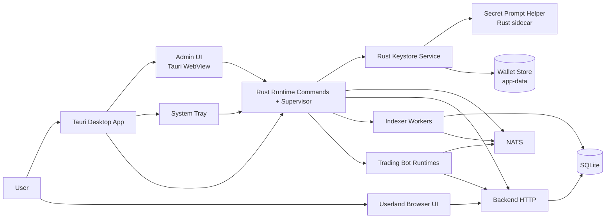

# Desktop Components Overview

High-level static composition of desktop runtime components and boundaries.

## Notes

- Admin UI is privileged through Tauri command bridge.
- Userland browser UI is unprivileged and accesses backend over localhost HTTP.
- Runtime process orchestration happens only in Rust supervisor.
- Raw secret entry/reveal happens only through the native secret-prompt sidecar, not in the WebView.
- Wallet material is stored separately from SQLite under desktop app-data.
