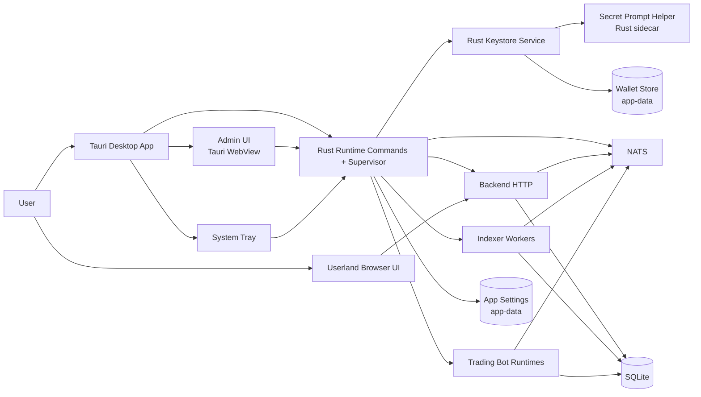

# Desktop Components Overview

High-level static composition of desktop runtime components and boundaries.

```mermaid
flowchart LR
    U[User]
    TW[Tauri Desktop App]
    AU[Admin UI<br/>Tauri WebView]
    TR[System Tray]
    RT[Rust Runtime Commands + Supervisor]
    KS[Rust Keystore Service]
    SP[Secret Prompt Helper<br/>Rust sidecar]
    NATS[NATS]
    BE[Backend HTTP]
    IDX[Indexer Workers]
    BOT[Trading Bot Runtimes]
    B[Userland Browser UI]
    DB[(SQLite)]
    AS[(App Settings<br/>app-data)]
    WS[(Wallet Store<br/>app-data)]

    U --> TW
    TW --> AU
    TW --> TR
    TW --> RT

    AU --> RT
    TR --> RT
    RT --> AS
    RT --> KS
    KS --> SP
    KS --> WS

    RT --> NATS
    RT --> BE
    RT --> IDX
    RT --> BOT

    BE --> DB
    BE --> NATS
    IDX --> DB
    IDX --> NATS
    BOT --> NATS
    BOT --> DB

    U --> B
    B --> BE
```

## Notes

- Admin UI is privileged through Tauri command bridge.
- Userland browser UI has no Tauri bridge. It accesses the backend over
  localhost HTTP for reads and CSRF-guarded local mutations.
- Admin-managed application settings cross the Tauri command boundary before
  Rust writes app-data JSON and renders the runtime `.env` for child-process
  startup.
- Runtime process orchestration happens only in Rust supervisor.
- Raw secret entry/reveal happens only through the native secret-prompt sidecar, not in the WebView.
- Wallet material is stored separately from SQLite under desktop app-data.
