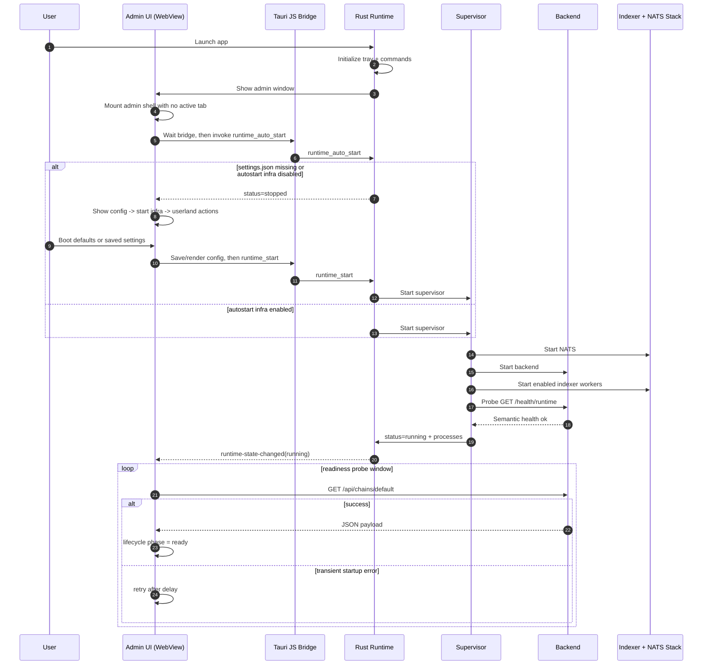

# Desktop Startup Happy Path

Boot sequence from app launch to runtime readiness.

## Result

- Runtime is running and semantically healthy.
- Admin lifecycle transitions to `ready`.
- Wallet-bound bot runtimes remain stopped/locked until the operator assigns a wallet and starts them explicitly.
