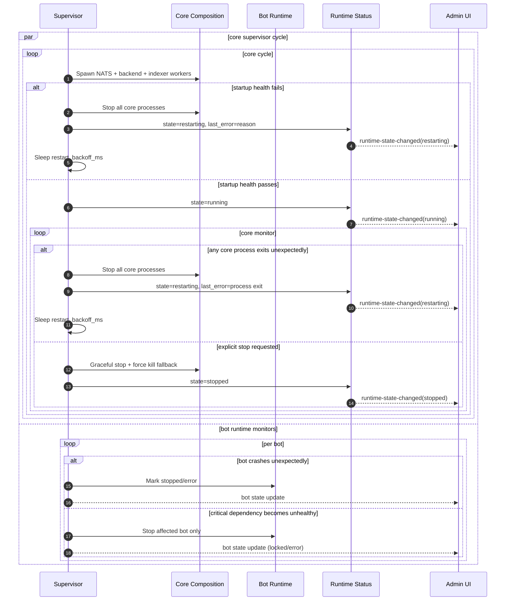

# Desktop Failure and Restart Loop

Fail-fast restart behavior for core composition failures, with independent bot shutdown behavior.

## Result

- Any core runtime failure causes full-stack restart.
- Bot failures do not restart the core composition.
- Restarting a bot later still requires a fresh unlock prompt.
