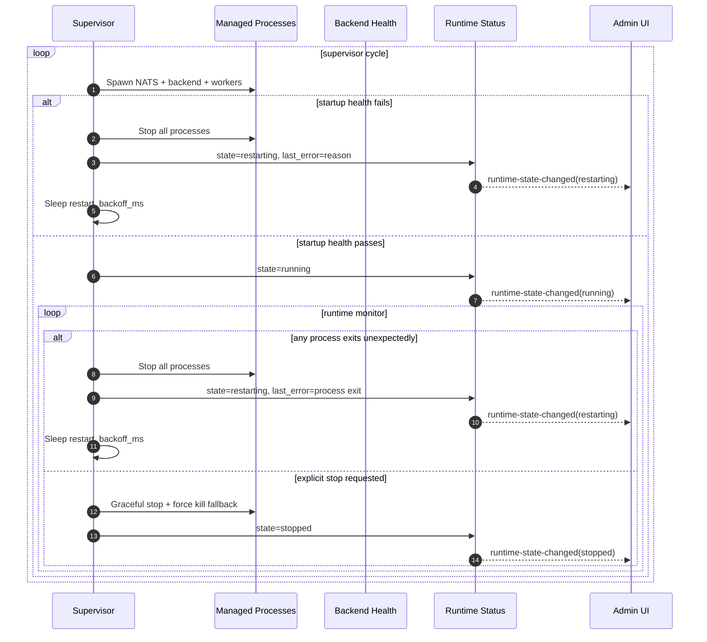

# Desktop Failure and Restart Loop

Fail-fast restart behavior for startup and runtime failures.

## Result

- Any core runtime failure causes full-stack restart.
- Partial runtime operation is intentionally not allowed.
