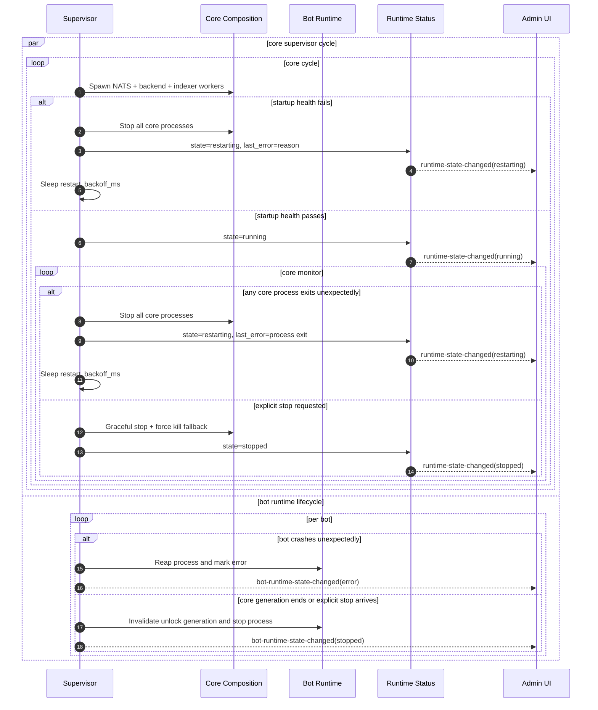

# Desktop Failure and Restart Loop

Fail-fast restart behavior for core composition failures, with separately
started wallet-bound bots.

```mermaid
sequenceDiagram
    autonumber
    participant S as Supervisor
    participant C as Core Composition
    participant BT as Bot Runtime
    participant R as Runtime Status
    participant A as Admin UI

    par core supervisor cycle
        loop core cycle
            S->>C: Spawn NATS + backend + indexer workers
            alt startup health fails
                S->>C: Stop all core processes
                S->>R: state=restarting, last_error=reason
                R-->>A: runtime-state-changed(restarting)
                S->>S: Sleep restart_backoff_ms
            else startup health passes
                S->>R: state=running
                R-->>A: runtime-state-changed(running)

                loop core monitor
                    alt any core process exits unexpectedly
                        S->>C: Stop all core processes
                        S->>R: state=restarting, last_error=process exit
                        R-->>A: runtime-state-changed(restarting)
                        S->>S: Sleep restart_backoff_ms
                    else explicit stop requested
                        S->>C: Graceful stop + force kill fallback
                        S->>R: state=stopped
                        R-->>A: runtime-state-changed(stopped)
                    end
                end
            end
        end
    and bot runtime lifecycle
        loop per bot
            alt bot crashes unexpectedly
                S->>BT: Reap process and mark error
                S-->>A: bot-runtime-state-changed(error)
            else core generation ends or explicit stop arrives
                S->>BT: Invalidate unlock generation and stop process
                S-->>A: bot-runtime-state-changed(stopped)
            end
        end
    end
```

## Result

- Any core runtime failure causes full-stack restart.
- Bot failures do not restart the core composition.
- A core restart does not carry wallet authority into its replacement
  generation. Restarting a bot later requires a fresh native unlock prompt.
