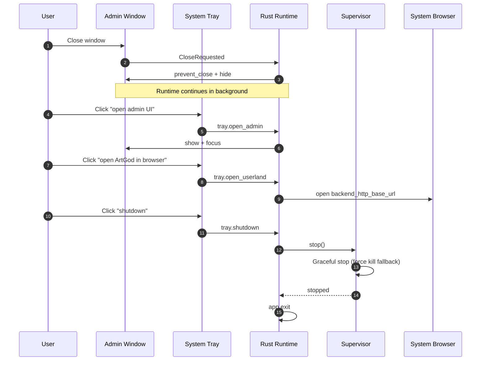

# Desktop Window and Tray Operations

Window hide behavior and tray-driven operations.

## Notes

- Admin shell header action to enter the userland triggers the same open-userland action.
- Tray double-click can also trigger open-userland where supported by the platform.
