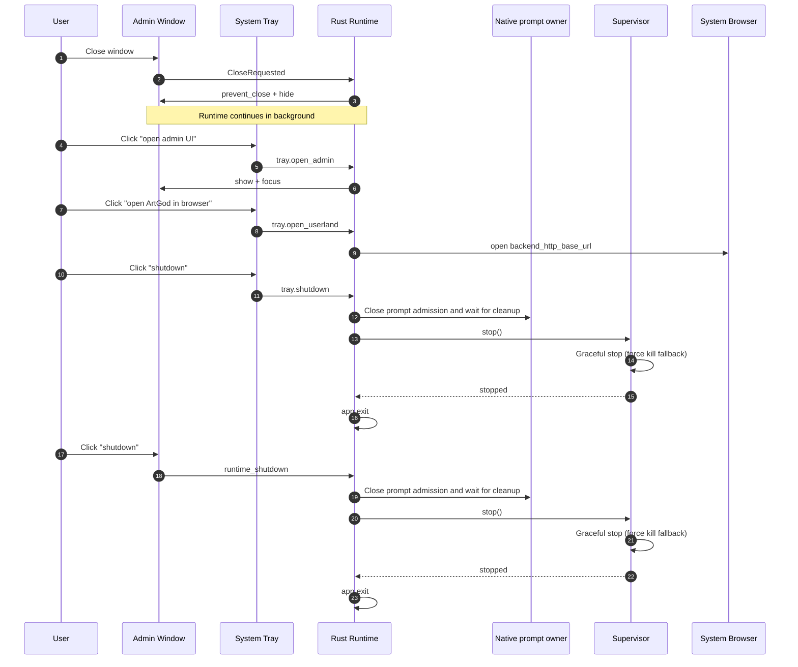

# Desktop Window and Tray Operations

Window hide behavior and tray-driven operations.

```mermaid
sequenceDiagram
    autonumber
    participant U as User
    participant W as Admin Window
    participant TR as System Tray
    participant R as Rust Runtime
    participant P as Native prompt owner
    participant S as Supervisor
    participant OS as System Browser

    U->>W: Close window
    W->>R: CloseRequested
    R->>W: prevent_close + hide
    Note over W,R: Runtime continues in background

    U->>TR: Click "open admin UI"
    TR->>R: tray.open_admin
    R->>W: show + focus

    U->>TR: Click "open ArtGod in browser"
    TR->>R: tray.open_userland
    R->>OS: open backend_http_base_url

    U->>TR: Click "shutdown"
    TR->>R: tray.shutdown
    R->>P: Close prompt admission and wait for cleanup
    R->>S: stop()
    S->>S: Graceful stop (force kill fallback)
    S-->>R: stopped
    R->>R: app exit

    U->>W: Click "shutdown"
    W->>R: runtime_shutdown
    R->>P: Close prompt admission and wait for cleanup
    R->>S: stop()
    S->>S: Graceful stop (force kill fallback)
    S-->>R: stopped
    R->>R: app exit
```

## Notes

- Admin shell header action to enter the userland triggers the same open-userland action.
- Admin shell shutdown triggers the same graceful runtime shutdown path as the tray action.
- Shutdown closes native prompt admission before stopping bots and the core runtime.
- Tray double-click can also trigger open-userland where supported by the platform.
