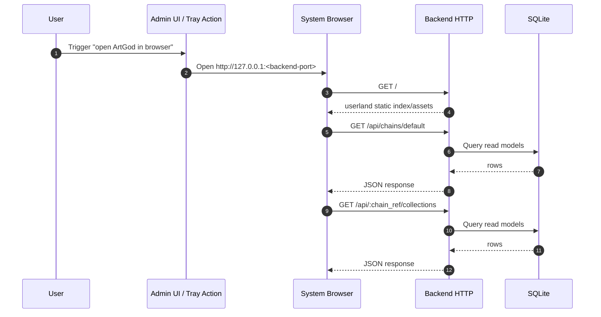

# Userland Browser Request Path

Userland browser flow for static page load and API reads.

## Boundary

- Userland browser UI does not use Tauri command bridge.
- Privileged operations remain in admin/tray native surface.
