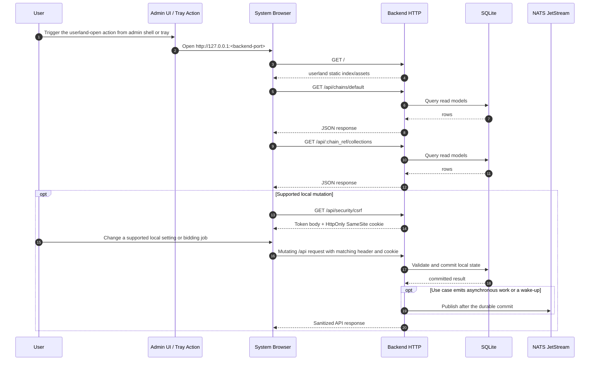

# Userland Browser Request Path

Userland browser flow for page load, API reads, and guarded local mutations in
the standard desktop deployment mode.

```mermaid
sequenceDiagram
    autonumber
    participant U as User
    participant A as Admin UI / Tray Action
    participant BR as System Browser
    participant BE as Backend HTTP
    participant DB as SQLite
    participant NATS as NATS JetStream

    U->>A: Trigger the userland-open action from admin shell or tray
    A->>BR: Open http://127.0.0.1:<backend-port>

    BR->>BE: GET /
    BE-->>BR: userland static index/assets

    BR->>BE: GET /api/chains/default
    BE->>DB: Query read models
    DB-->>BE: rows
    BE-->>BR: JSON response

    BR->>BE: GET /api/:chain_ref/collections
    BE->>DB: Query read models
    DB-->>BE: rows
    BE-->>BR: JSON response

    opt Supported local mutation
        BR->>BE: GET /api/security/csrf
        BE-->>BR: Token body + HttpOnly SameSite cookie
        U->>BR: Change a supported local setting or bidding job
        BR->>BE: Mutating /api request with matching header and cookie
        BE->>DB: Validate and commit local state
        DB-->>BE: committed result
        opt Use case emits asynchronous work or a wake-up
            BE->>NATS: Publish after the durable commit
        end
        BE-->>BR: Sanitized API response
    end
```

## Boundary

- Userland browser UI does not use Tauri command bridge.
- Standard mode permits only the backend mutations that are explicitly
  registered and protected by host, origin, and double-submit CSRF checks.
- Public single-collection mode does not register the CSRF issuer or mutation
  routes.
- Wallet secrets, native authorization, bot process start/stop, and desktop
  runtime control remain in the Admin/Rust boundary.
