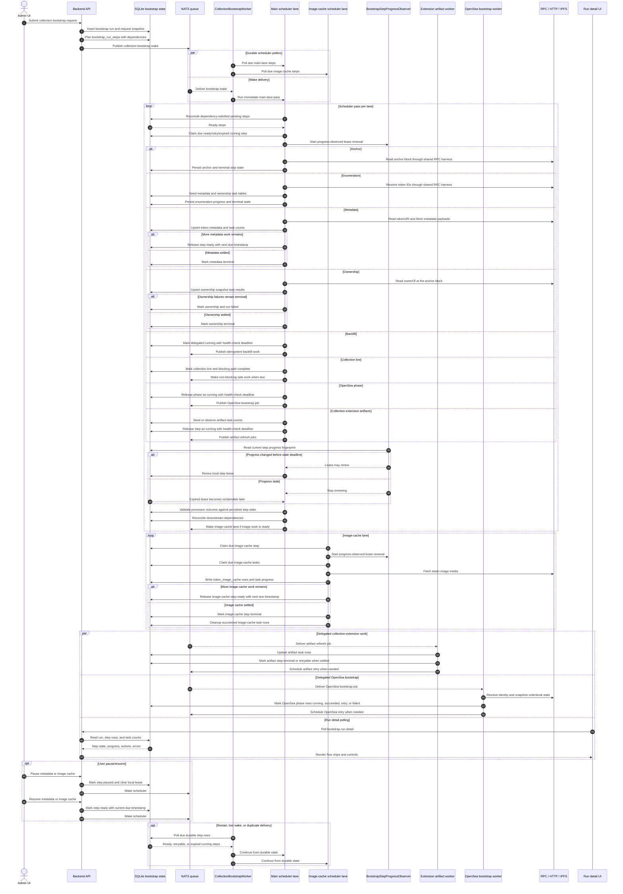

# Bootstrap Pipeline Sequence

This diagram describes the current scheduler-first bootstrap implementation.
It is meant to clarify runtime ownership rather than restate every executor
detail.

The source of truth is durable SQLite state:

- `bootstrap_runs` stores the request/config snapshot and top-level run state.
- `bootstrap_run_steps` stores the planned pipeline, dependencies, leases,
  health-check deadlines, progress, timing, and terminal results.
- Step task tables store fan-out work for metadata, ownership, image cache, and
  collection-extension artifact refresh.

Queue messages are wake-ups and delegated work delivery. They reduce latency,
but they are not the source of pipeline state.

## Runtime Shape

`CollectionBootstrapWorker` owns the bootstrap scheduler. It currently starts
two scheduler pollers:

- main lane: anchor, enumeration, metadata, ownership, backfill,
  collection-live, OpenSea phase handoff, and collection-extension artifact
  handoff
- image-cache lane: image-cache task processing

OpenSea bootstrap and collection-extension artifacts are not separate scheduler
lanes in this implementation. They are planned bootstrap steps in
`bootstrap_run_steps`, but their actual work is delegated to queue consumers.
Those consumers update the same durable step/task rows so the run detail UI can
still show coherent progress and terminal state.

## Progress And Liveness

The scheduler claims due steps with a local lease. While a claimed processor is
running, `BootstrapStepProgressObserver` reads existing durable progress and
lets lease renewal continue only while the step is observably alive. If progress
stops changing beyond the configured stale-progress window, lease renewal stops;
the expired lease then becomes normal scheduler recovery work.

Delegated work is represented as a running step with a health-check deadline
rather than a local lease. When that deadline becomes due, the main scheduler
can claim the step again and decide whether to republish work, observe terminal
state, or retry.

Pause/resume is currently step-level and exposed for metadata and image cache.

## Sequence

## Reading The Diagram

- A claimed local step is protected by a lease, not by the queue message that
  woke the scheduler.
- The progress observer is read-only. It does not write task progress; it only
  decides whether local lease renewal is still justified.
- A delegated step keeps its bootstrap step row authoritative even while the
  work runs in another queue consumer.
- `collection_live` marks the blocking bootstrap path complete. Non-blocking
  work such as image cache, OpenSea bootstrap, and collection-extension artifact
  refresh can continue independently of that marker.
- The run detail UI should be explainable from `bootstrap_run_steps` plus task
  counts. Worker-local state should never be required to understand progress.
