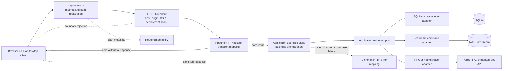

# Backend Hexagonal Request Flow

This diagram shows the runtime call flow for one backend request.
`backend/src/index.ts` wires outbound adapters and use cases, while
`backend/src/http-app.ts` wires inbound HTTP adapters and common hooks.

## Dependency Rule

- Routes depend on inbound adapters, not concrete database or SDK adapters, and
  attach route-specific deployment guards and observability metadata.
- Inbound adapters translate transport data and call exported use-case methods.
- Use cases depend on domain types and application outbound port contracts.
- Concrete outbound adapters implement those ports and are wired one by one in
  `backend/src/index.ts`.
- Common HTTP code provides reusable query parsing, headers, security hooks,
  observability, and error mapping; route-specific parsing remains in inbound
  adapters.

See [API and application architecture](../backend/01-api-and-application-architecture.md)
and the [OpenAPI reference](../backend/openapi.yaml).
