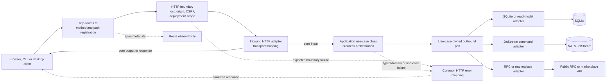

# Backend Hexagonal Request Flow

This diagram shows dependency direction for one backend request. The
composition root is the only layer that knows concrete adapters.

## Dependency Rule

- Routes depend on inbound adapters, not concrete database or SDK adapters.
- Inbound adapters translate transport data and call exported use-case methods.
- Use cases depend on domain types and locally owned outbound ports.
- Concrete outbound adapters implement those ports and are wired one by one in
  `backend/src/index.ts`.
- Common HTTP code owns parsing, headers, and error mapping; it does not own
  business behavior.

See [API and application architecture](../backend/01-api-and-application-architecture.md)
and the [OpenAPI reference](../backend/openapi.yaml).
