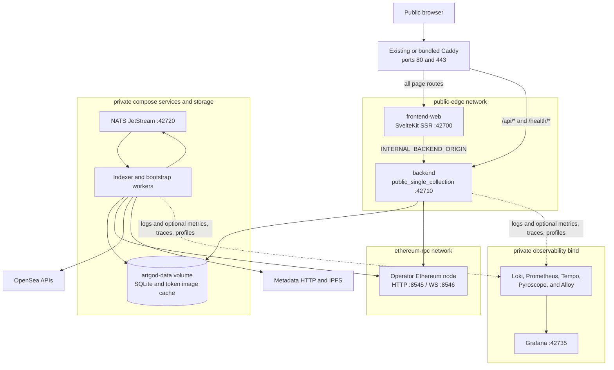

# Hosted Read-Only Topology

The hosted deployment is a self-operated, fixed-collection read surface. Only
the reverse proxy is public; application services remain on Docker networks and
state remains in private volumes.

## Exposure Contract

- `frontend-web`, backend, NATS, and worker services have no permanent host port
  publication in the default deploy composition; SQLite and cached media remain
  inside the shared `artgod-data` volume.
- Public mode keeps health, default-chain, and runtime-config reads plus
  scope-guarded collection and chain reads. It omits collection listing,
  bootstrap, customization routes, trading mutations, and CSRF issuance.
- The frontend server uses `INTERNAL_BACKEND_ORIGIN` for SSR. Browser API reads
  use the public same-origin proxy path.
- Grafana is published only on the explicitly configured private host address;
  it does not join `public-edge`.

See the [hosted deployment runbook](../deploy/01-web-hosted-read-only.md) and
[HTTP security modes](../backend/02-http-security-and-deployment-modes.md).
