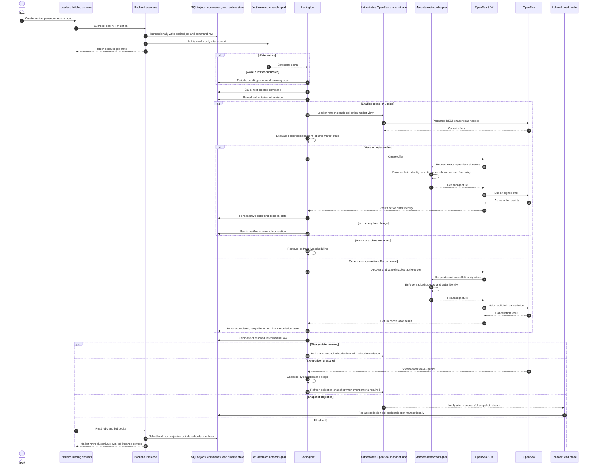

# Bidding Command and Offer Lifecycle

SQLite owns declared jobs and command state. JetStream reduces reaction latency,
while the bot's recovery scan makes command delivery durable.

Offchain cancellation intentionally remains available when placement authority
is absent so paused or archived jobs can recover tracked offers. Stopping the
bot does not itself cancel existing OpenSea orders or revoke WETH allowance.
Pause/archive and cancellation are separate durable commands; cancellation
can retry after the job has already left live scheduling. A cancellation
command with no tracked active order completes without a marketplace call.

See [bidding runtime and jobs](../trading/01-bidding-runtime-and-jobs.md) and
[automation capabilities](../trading/02-bidding-automation-capabilities.md).
