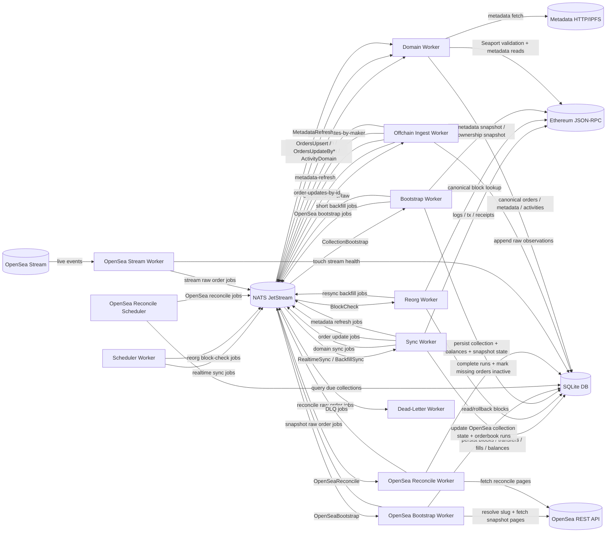

```mermaid
flowchart LR
      RPC[(Ethereum JSON-RPC)]
      OSStream[(OpenSea Stream)]
      OSApi[(OpenSea REST API)]
      MetaHTTP[(Metadata HTTP/IPFS)]

      NATS[(NATS JetStream)]
      DB[(SQLite DB)]

      Scheduler[Scheduler Worker]
      Sync[Sync Worker]
      Reorg[Reorg Worker]
      Bootstrap[Bootstrap Worker]
      OSBootstrap[OpenSea Bootstrap Worker]
      OSReconcileSched[OpenSea Reconcile Scheduler]
      OSReconcile[OpenSea Reconcile Worker]
      OSWorker[OpenSea Stream Worker]
      Offchain[Offchain Ingest Worker]
      Domain[Domain Worker]
      DeadLetter[Dead-Letter Worker]

      Scheduler -->|realtime sync jobs| NATS
      Scheduler -->|reorg block-check jobs| NATS

      NATS -->|RealtimeSync / BackfillSync| Sync
      Sync -->|logs / tx / receipts| RPC
      Sync -->|persist blocks / transfers / fills / balances| DB
      Sync -->|domain sync jobs| NATS
      Sync -->|order update jobs| NATS
      Sync -->|metadata refresh jobs| NATS

      NATS -->|BlockCheck| Reorg
      Reorg -->|read/rollback blocks| DB
      Reorg -->|canonical block lookup| RPC
      Reorg -->|resync backfill jobs| NATS

      NATS -->|CollectionBootstrap| Bootstrap
      Bootstrap -->|metadata snapshot / ownership snapshot| RPC
      Bootstrap -->|persist collection + balances + snapshot state| DB
      Bootstrap -->|short backfill jobs| NATS
      Bootstrap -->|OpenSea bootstrap jobs| NATS

      NATS -->|OpenSeaBootstrap| OSBootstrap
      OSBootstrap -->|resolve slug + fetch snapshot pages| OSApi
      OSBootstrap -->|update OpenSea collection state + orderbook runs| DB
      OSBootstrap -->|snapshot raw order jobs| NATS

      OSReconcileSched -->|query due collections| DB
      OSReconcileSched -->|OpenSea reconcile jobs| NATS
      NATS -->|OpenSeaReconcile| OSReconcile
      OSReconcile -->|fetch reconcile pages| OSApi
      OSReconcile -->|complete runs + mark missing orders inactive| DB
      OSReconcile -->|reconcile raw order jobs| NATS

      OSStream -->|live events| OSWorker
      OSWorker -->|touch stream health| DB
      OSWorker -->|stream raw order jobs| NATS

      NATS -->|OffchainOrdersRaw| Offchain
      Offchain -->|append raw observations| DB
      Offchain -->|orders.upsert| NATS
      Offchain -->|order-updates-by-id| NATS
      Offchain -->|order-updates-by-maker| NATS
      Offchain -->|metadata-refresh| NATS

      NATS -->|OrdersDomain / MetadataDomain / ActivityDomain| Domain
      NATS -->|OrdersUpsert / OrdersUpdateBy*| Domain
      NATS -->|MetadataRefresh| Domain
      Domain -->|canonical orders / metadata / activities| DB
      Domain -->|Seaport validation + metadata reads| RPC
      Domain -->|metadata fetch| MetaHTTP

      NATS -->|DLQ jobs| DeadLetter
```
