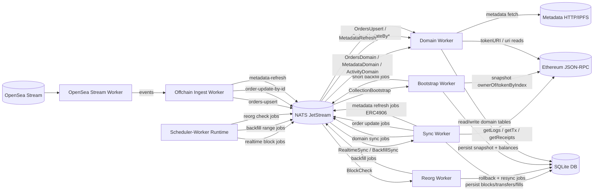

```mermaid
flowchart LR
      %% External systems
      RPC[(Ethereum JSON-RPC)]
      OS[(OpenSea Stream)]
      MetaHTTP[(Metadata HTTP/IPFS)]

      %% Core infra
      NATS[(NATS JetStream)]
      DB[(SQLite DB)]

      %% Runtimes
      SchedulerWorker[Scheduler-Worker Runtime]
      SyncWorker[Sync Worker]
      ReorgWorker[Reorg Worker]
      BootstrapWorker[Bootstrap Worker]
      OffchainIngest[Offchain Ingest Worker]
      OpenSeaStream[OpenSea Stream Worker]
      DomainWorker[Domain Worker]

      %% SchedulerWorker -> sync jobs
      SchedulerWorker -->|realtime block jobs| NATS
      SchedulerWorker -->|backfill range jobs| NATS
      SchedulerWorker -->|reorg check jobs| NATS

      %% Sync pipeline
      NATS -->|RealtimeSync / BackfillSync| SyncWorker
      SyncWorker -->|getLogs / getTx / getReceipts| RPC
      SyncWorker -->|persist blocks/transfers/fills| DB
      SyncWorker -->|domain sync jobs| NATS
      SyncWorker -->|order update jobs| NATS
      SyncWorker -->|metadata refresh jobs ERC4906| NATS

      %% Reorg handling
      NATS -->|BlockCheck| ReorgWorker
      ReorgWorker -->|rollback + resync jobs| DB
      ReorgWorker -->|backfill jobs| NATS

      %% Bootstrap
      NATS -->|CollectionBootstrap| BootstrapWorker
      BootstrapWorker -->|snapshot ownerOf/tokenByIndex| RPC
      BootstrapWorker -->|persist snapshot + balances| DB
      BootstrapWorker -->|short backfill jobs| NATS

      %% Offchain ingestion
      OpenSeaStream -->|events| OffchainIngest
      OffchainIngest -->|orders-upsert| NATS
      OffchainIngest -->|order-update-by-id| NATS
      OffchainIngest -->|metadata-refresh| NATS
      OS --> OpenSeaStream

      %% Domain worker
      NATS -->|OrdersDomain / MetadataDomain / ActivityDomain| DomainWorker
      NATS -->|OrdersUpsert / OrdersUpdateBy*| DomainWorker
      NATS -->|MetadataRefresh| DomainWorker
      DomainWorker -->|read/write domain tables| DB
      DomainWorker -->|tokenURI / uri reads| RPC
      DomainWorker -->|metadata fetch| MetaHTTP
```
