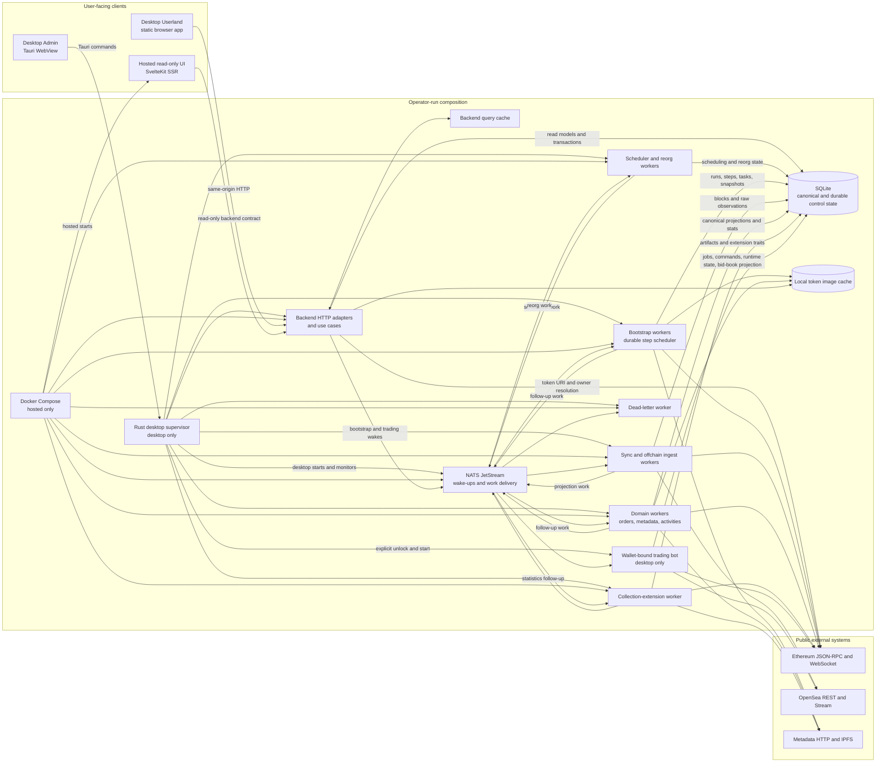

# ArtGod System Architecture

ArtGod has no centralized application server. The desktop composition and the
optional hosted composition are operator-run deployments of the same
backend/worker/broker/database software stack, and each deployment owns its own
state. The Rust supervisor and Docker Compose are alternative composition roots,
not concurrent launchers. Hosted mode narrows the public HTTP surface; it does
not move canonical state to an ArtGod service.

## Durable-State Boundary

- SQLite, not JetStream delivery, owns bootstrap progress, declared trading
  jobs, command reconciliation, canonical indexed state, and read projections.
- JetStream carries scheduler wake-ups and bounded work such as realtime sync,
  backfill, metadata refresh, metadata statistics, activity upsert, OpenSea raw
  observations, and dead-letter handling.
- OpenSea stream events and Ethereum WebSocket heads are hints. Canonical chain
  reads, reconciliation, snapshots, and durable cursors recover missed or
  duplicate delivery.

Follow the [backend architecture](../backend/01-api-and-application-architecture.md),
[indexer overview](../indexer/00-overview.md), and
[bidding runtime](../trading/01-bidding-runtime-and-jobs.md) for exact ownership.
