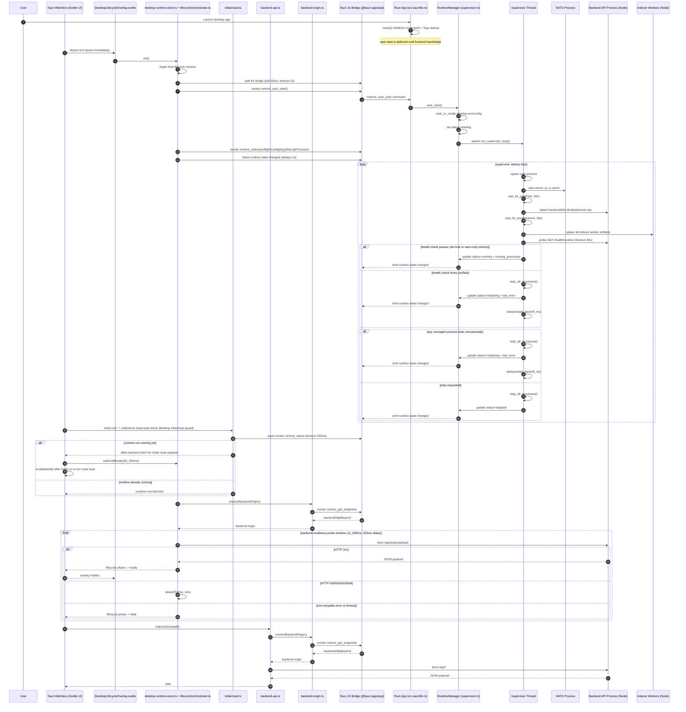
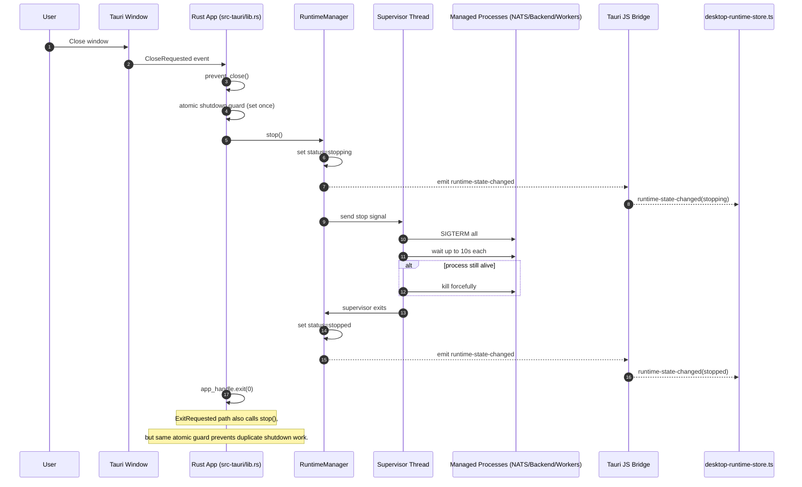

# Desktop Runtime Lifecycle Sequence

This diagram shows the current desktop startup, readiness gating, backend API request flow, restart loop, and graceful shutdown behavior.

Runtime context:

- `src-tauri/*` runs in the native Rust desktop process.
- `frontend/src/lib/runtime/lifecycle/*` and `frontend/src/lib/backend-api.ts` run in the Tauri WebView JavaScript runtime (browser context).
- `backend` and all `indexer` workers run as separate child Node.js processes managed by the Rust supervisor.

## Startup + Readiness + API Request

## Window Close / Exit (Graceful Stop)

## Key Timing Controls

- Tauri bridge init wait timeout: `2_000ms`
- Tauri bridge init poll interval: `50ms`
- desktop initial-load quick runtime status timeout: `250ms`
- `waitUntilReady` poll interval: `300ms`
- `waitUntilReady` timeout: `30_000ms`
- lifecycle backend readiness probe window: `12_000ms`
- lifecycle backend readiness probe retry delay: `250ms`
- supervisor port wait timeout per critical process: `30s`
- supervisor semantic backend health timeout (`/health/runtime`): `30s`
- process graceful stop wait: `10s`
- supervisor startup waits/backoff are stop-signal cancellable
