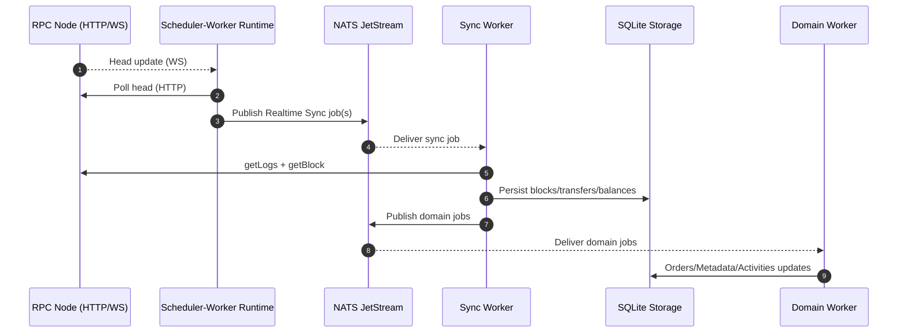
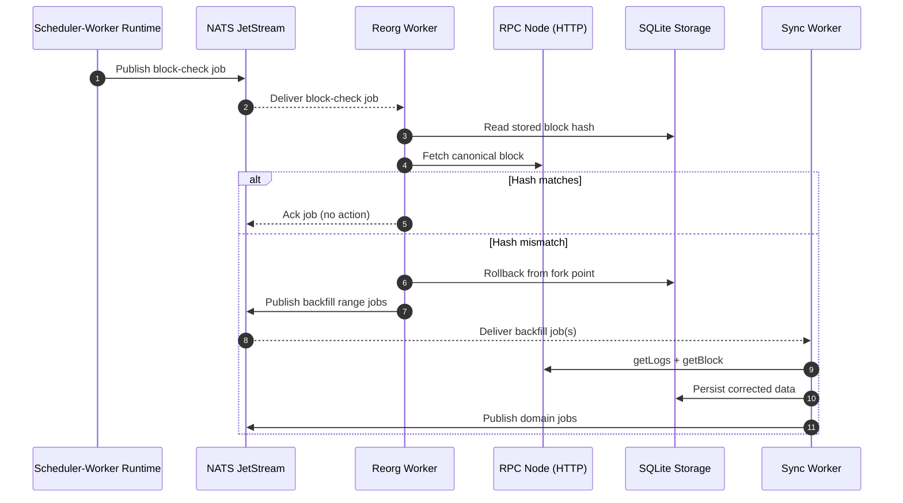

# Sequence Diagrams (High-Level)

These Mermaid diagrams provide a top-level, C4-style view of how indexer containers and queues interact. They are intentionally high-level and omit internal details.

## Realtime Sync + Domain Fanout

## Reorg Check + Rollback + Resync

