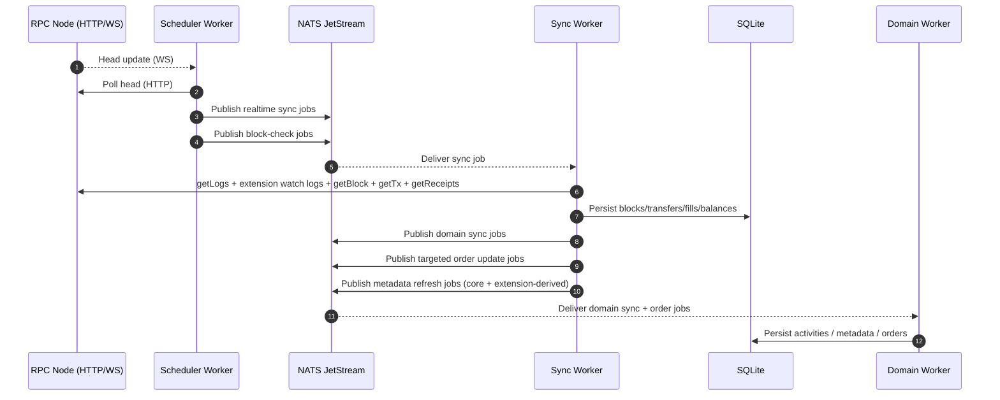
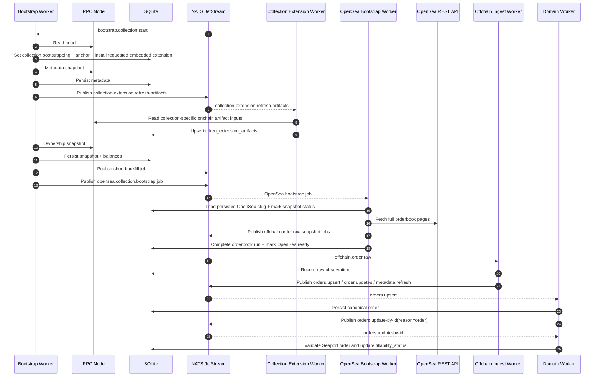
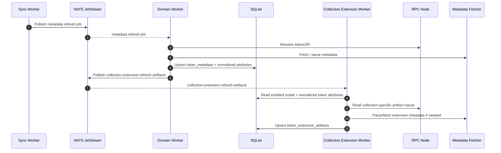
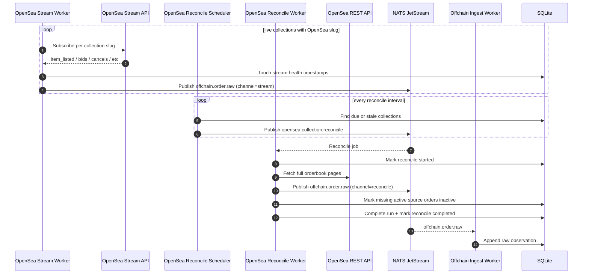

# Sequence Diagrams (High-Level)

These Mermaid diagrams show the current high-level runtime interactions for the indexer and the OpenSea offchain pipeline.

## Realtime Sync + Domain Fanout

## Collection Bootstrap + OpenSea Bootstrap

## Canonical Metadata Refresh + Collection Extension Artifacts

## OpenSea Stream + Reconcile

