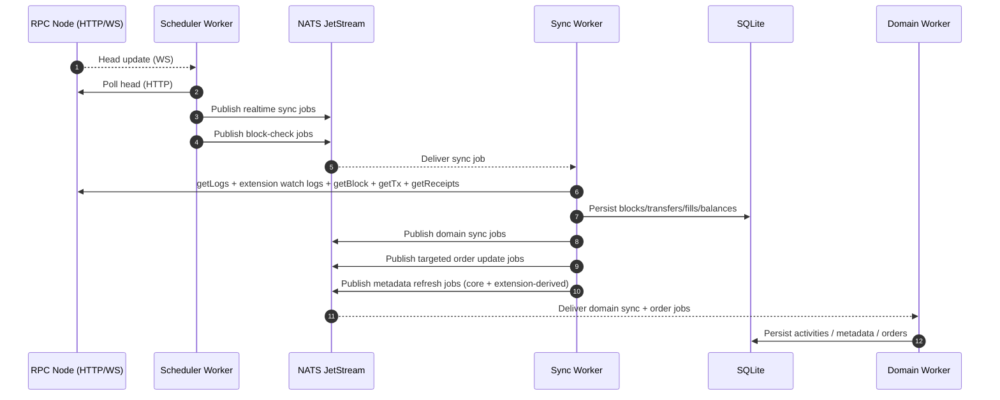
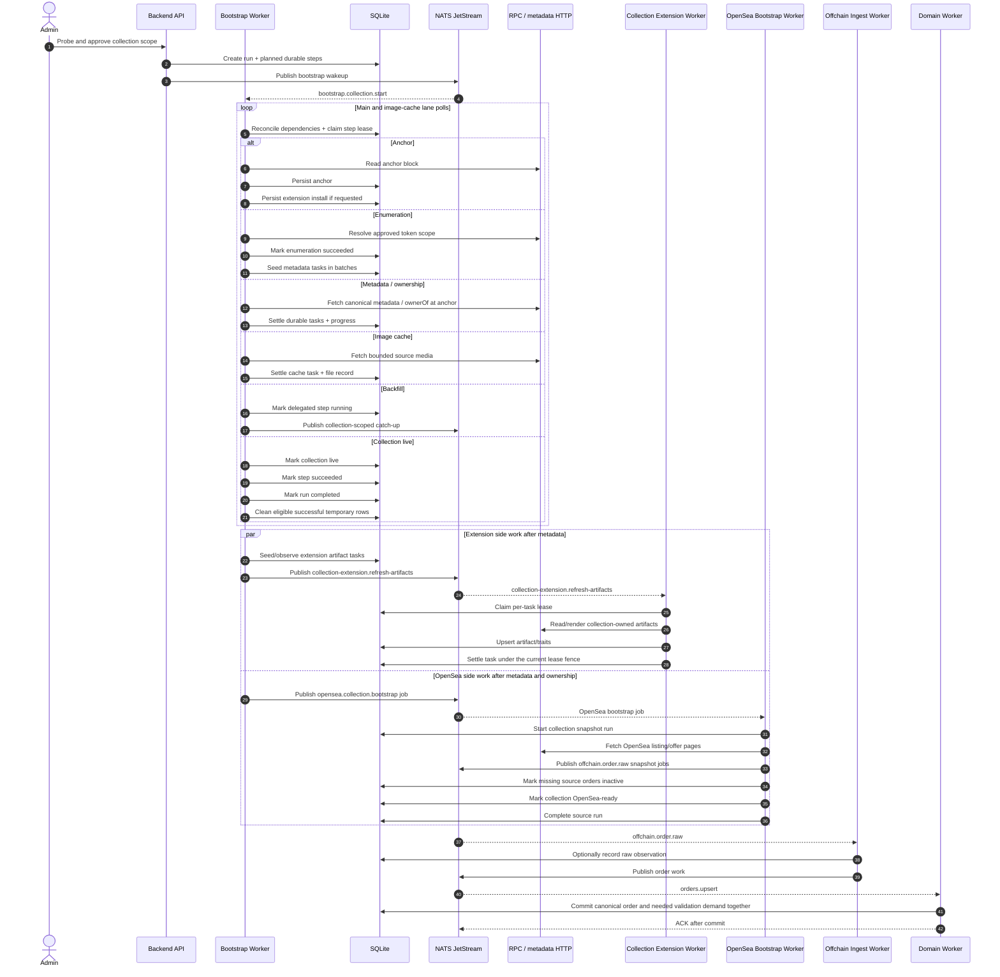
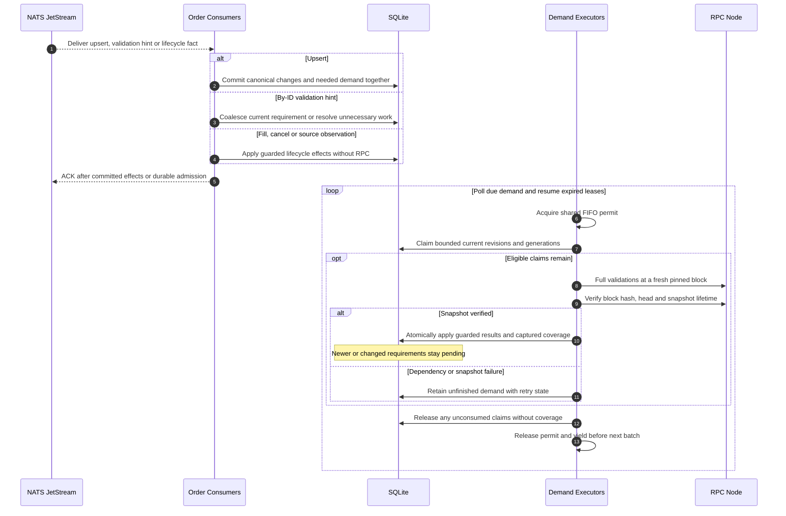
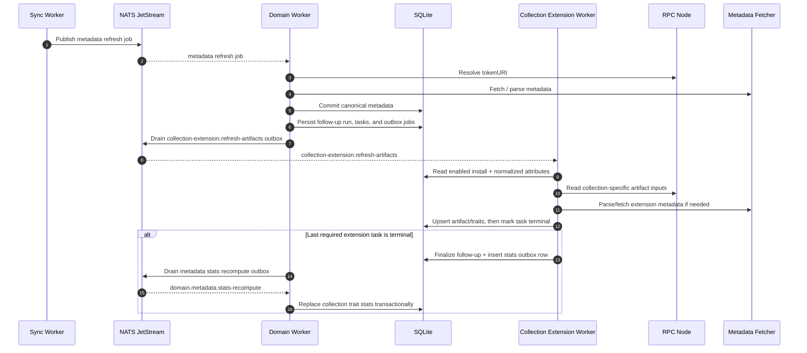
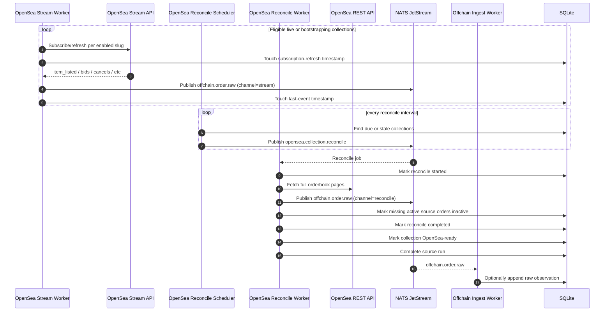

# Sequence Diagrams (High-Level)

These Mermaid diagrams show the current high-level runtime interactions for the indexer and the OpenSea offchain pipeline.

## Realtime Sync + Domain Fanout

```mermaid
sequenceDiagram
    autonumber
    participant RPC as RPC Node (HTTP/WS)
    participant Scheduler as Scheduler Worker
    participant NATS as NATS JetStream
    participant Sync as Sync Worker
    participant DB as SQLite
    participant Domain as Domain Worker

    RPC-->>Scheduler: Head update (WS)
    Scheduler->>RPC: Poll head (HTTP)
    Scheduler->>NATS: Publish realtime sync jobs
    Scheduler->>NATS: Publish block-check jobs

    NATS-->>Sync: Deliver sync job
    Sync->>RPC: getLogs + extension watch logs + getBlock + getTx + getReceipts
    Sync->>DB: Persist blocks/transfers/fills/balances
    Sync->>NATS: Publish domain sync jobs
    Sync->>NATS: Publish targeted order update jobs
    Sync->>NATS: Publish metadata refresh jobs (core + extension-derived)

    NATS-->>Domain: Deliver domain sync + order jobs
    Domain->>DB: Persist activities / metadata / orders
```

## Collection Bootstrap + OpenSea Bootstrap

```mermaid
sequenceDiagram
    autonumber
    actor Admin
    participant API as Backend API
    participant Bootstrap as Bootstrap Worker
    participant DB as SQLite
    participant NATS as NATS JetStream
    participant RPC as RPC / metadata HTTP
    participant Ext as Collection Extension Worker
    participant OSBoot as OpenSea Bootstrap Worker
    participant Offchain as Offchain Ingest Worker
    participant Domain as Domain Worker

    Admin->>API: Probe and approve collection scope
    API->>DB: Create run + planned durable steps
    API->>NATS: Publish bootstrap wakeup
    NATS-->>Bootstrap: bootstrap.collection.start

    loop Main and image-cache lane polls
        Bootstrap->>DB: Reconcile dependencies + claim step lease
        alt Anchor
            Bootstrap->>RPC: Read anchor block
            Bootstrap->>DB: Persist anchor
            Bootstrap->>DB: Persist extension install if requested
        else Enumeration
            Bootstrap->>RPC: Resolve approved token scope
            Bootstrap->>DB: Mark enumeration succeeded
            Bootstrap->>DB: Seed metadata tasks in batches
        else Metadata / ownership
            Bootstrap->>RPC: Fetch canonical metadata / ownerOf at anchor
            Bootstrap->>DB: Settle durable tasks + progress
        else Image cache
            Bootstrap->>RPC: Fetch bounded source media
            Bootstrap->>DB: Settle cache task + file record
        else Backfill
            Bootstrap->>DB: Mark delegated step running
            Bootstrap->>NATS: Publish collection-scoped catch-up
        else Collection live
            Bootstrap->>DB: Mark collection live
            Bootstrap->>DB: Mark step succeeded
            Bootstrap->>DB: Mark run completed
            Bootstrap->>DB: Clean eligible successful temporary rows
        end
    end

    par Extension side work after metadata
        Bootstrap->>DB: Seed/observe extension artifact tasks
        Bootstrap->>NATS: Publish collection-extension.refresh-artifacts
        NATS-->>Ext: collection-extension.refresh-artifacts
        Ext->>DB: Claim per-task lease
        Ext->>RPC: Read/render collection-owned artifacts
        Ext->>DB: Upsert artifact/traits
        Ext->>DB: Settle task under the current lease fence
    and OpenSea side work after metadata and ownership
        Bootstrap->>NATS: Publish opensea.collection.bootstrap job
        NATS-->>OSBoot: OpenSea bootstrap job
        OSBoot->>DB: Start collection snapshot run
        OSBoot->>RPC: Fetch OpenSea listing/offer pages
        OSBoot->>NATS: Publish offchain.order.raw snapshot jobs
        OSBoot->>DB: Mark missing source orders inactive
        OSBoot->>DB: Mark collection OpenSea-ready
        OSBoot->>DB: Complete source run
    end

    NATS-->>Offchain: offchain.order.raw
    Offchain->>DB: Optionally record raw observation
    Offchain->>NATS: Publish order work

    NATS-->>Domain: orders.upsert
    Domain->>DB: Commit canonical order and needed validation demand together
    Domain-->>NATS: ACK after commit
```

Validation continues through the local demand loop below; upsert completion
does not publish a second broker envelope or imply validation completion.

## Order Admission and Validation

Consumers and executors here are separate tasks inside the same per-chain
domain-worker process. Lifecycle facts can commit while RPC validation is busy.
Demand, broad-maker and token validation share two FIFO permits. See
[processing ownership](07-domain-orders.md#processing-ownership-and-retained-state)
for the durable state and [ports](12-ports-and-adapters.md#order-processing-ports)
for the application boundaries.

```mermaid
sequenceDiagram
    autonumber
    participant NATS as NATS JetStream
    participant Consumer as Order Consumers
    participant DB as SQLite
    participant Demand as Demand Executors
    participant RPC as RPC Node

    NATS-->>Consumer: Deliver upsert, validation hint or lifecycle fact
    alt Upsert
        Consumer->>DB: Commit canonical changes and needed demand together
    else By-ID validation hint
        Consumer->>DB: Coalesce current requirement or resolve unnecessary work
    else Fill, cancel or source observation
        Consumer->>DB: Apply guarded lifecycle effects without RPC
    end
    Consumer-->>NATS: ACK after committed effects or durable admission

    loop Poll due demand and resume expired leases
        Demand->>Demand: Acquire shared FIFO permit
        Demand->>DB: Claim bounded current revisions and generations
        opt Eligible claims remain
            Demand->>RPC: Full validations at a fresh pinned block
            Demand->>RPC: Verify block hash, head and snapshot lifetime
            alt Snapshot verified
                Demand->>DB: Atomically apply guarded results and captured coverage
                Note over DB: Newer or changed requirements stay pending
            else Dependency or snapshot failure
                Demand->>DB: Retain unfinished demand with retry state
            end
        end
        Demand->>DB: Release any unconsumed claims without coverage
        Demand->>Demand: Release permit and yield before next batch
    end
```

## Maker Checkpoint and Recovery

Each delivery runs one bounded step. The checkpoint owns the atomic boundary
between order effects or handoff, cursor movement and continuation intent.
The outbox publishes afterward; its sent receipt alone is not completion proof.
See [durable maker progress](07-domain-orders.md#durable-maker-progress) for
isolation, follow-up generations, lease fencing and replay cleanup.

```mermaid
sequenceDiagram
    autonumber
    participant NATS as NATS JetStream
    participant Maker as Maker or Token Processor
    participant DB as SQLite
    participant RPC as RPC Node
    participant Outbox as Outbox Publisher
    participant Recovery as Maker Recovery

    NATS-->>Maker: Scoped hint or run/step continuation
    Maker->>DB: Admit or resume finite pass and claim lease
    Maker->>Maker: Acquire shared FIFO permit
    Maker->>RPC: Validate one bounded step at a fresh snapshot
    alt Results verified or isolated handoff available
        alt Successful validation results
            Maker->>RPC: Verify snapshot before committing results
            Maker->>DB: Commit effects, cursor and continuation intent together
        else Persisted isolated candidate read fails again
            Maker->>DB: Commit per-order demand, cursor and continuation intent together
            Note over DB: No failed result becomes validation coverage
        end
    else Shared, snapshot or checkpoint failure
        Maker->>DB: Keep previous cursor and retryable run
    end
    Maker->>Maker: Release permit and lease
    alt Checkpoint committed
        Maker-->>NATS: ACK after durable checkpoint
    else Step failed
        Maker-->>NATS: Delivery fails; saved run retains unfinished work
    end

    opt Scan or newer generation still needs a step
        Outbox->>DB: Read committed continuation
        Outbox->>NATS: Publish next step behind ready work
        Outbox->>DB: Record publication receipt
    end

    loop Bounded recovery and receipt cleanup
        Recovery->>DB: Read idle unfinished runs and delivery receipts
        Recovery->>NATS: Check publication identity and consumer ACK floors
        Recovery->>DB: Repair missing wakeups and reap eligible completed receipts
    end
    Note over DB: Completed maker scan may coexist with pending per-order demand
```

## Canonical Metadata Refresh + Collection Extension Artifacts

```mermaid
sequenceDiagram
    autonumber
    participant Sync as Sync Worker
    participant NATS as NATS JetStream
    participant Domain as Domain Worker
    participant DB as SQLite
    participant Ext as Collection Extension Worker
    participant RPC as RPC Node
    participant MetaHTTP as Metadata Fetcher

    Sync->>NATS: Publish metadata refresh job
    NATS-->>Domain: metadata refresh job
    Domain->>RPC: Resolve tokenURI
    Domain->>MetaHTTP: Fetch / parse metadata
    Domain->>DB: Commit canonical metadata
    Domain->>DB: Persist follow-up run, tasks, and outbox jobs
    Domain->>NATS: Drain collection-extension.refresh-artifacts outbox

    NATS-->>Ext: collection-extension.refresh-artifacts
    Ext->>DB: Read enabled install + normalized attributes
    Ext->>RPC: Read collection-specific artifact inputs
    Ext->>MetaHTTP: Parse/fetch extension metadata if needed
    Ext->>DB: Upsert artifact/traits, then mark task terminal
    alt Last required extension task is terminal
        Ext->>DB: Finalize follow-up + insert stats outbox row
        Domain->>NATS: Drain metadata stats recompute outbox
        NATS-->>Domain: domain.metadata.stats-recompute
        Domain->>DB: Replace collection trait stats transactionally
    end
```

## OpenSea Stream + Reconcile

```mermaid
sequenceDiagram
    autonumber
    participant Stream as OpenSea Stream Worker
    participant OSStream as OpenSea Stream API
    participant ReconcileSched as OpenSea Reconcile Scheduler
    participant Reconcile as OpenSea Reconcile Worker
    participant OSAPI as OpenSea REST API
    participant NATS as NATS JetStream
    participant Offchain as Offchain Ingest Worker
    participant DB as SQLite

    loop Eligible live or bootstrapping collections
        Stream->>OSStream: Subscribe/refresh per enabled slug
        Stream->>DB: Touch subscription-refresh timestamp
        OSStream-->>Stream: item_listed / bids / cancels / etc
        Stream->>NATS: Publish offchain.order.raw (channel=stream)
        Stream->>DB: Touch last-event timestamp
    end

    loop every reconcile interval
        ReconcileSched->>DB: Find due or stale collections
        ReconcileSched->>NATS: Publish opensea.collection.reconcile
    end

    NATS-->>Reconcile: Reconcile job
    Reconcile->>DB: Mark reconcile started
    Reconcile->>OSAPI: Fetch full orderbook pages
    Reconcile->>NATS: Publish offchain.order.raw (channel=reconcile)
    Reconcile->>DB: Mark missing active source orders inactive
    Reconcile->>DB: Mark reconcile completed
    Reconcile->>DB: Mark collection OpenSea-ready
    Reconcile->>DB: Complete source run

    NATS-->>Offchain: offchain.order.raw
    Offchain->>DB: Optionally append raw observation
```
