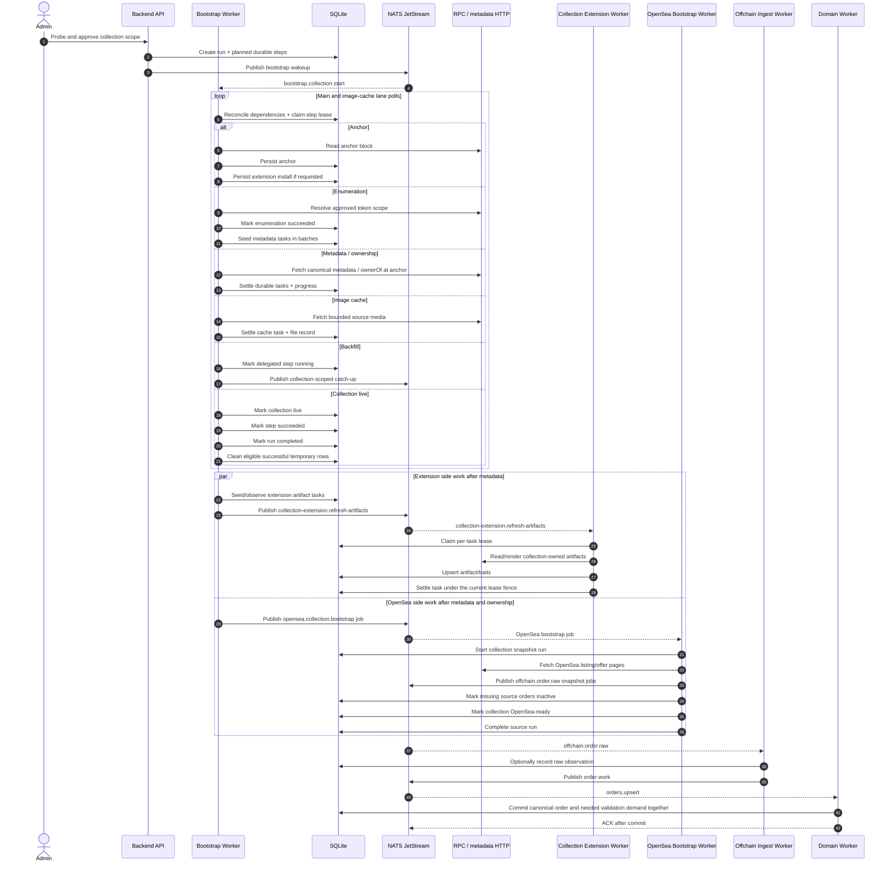
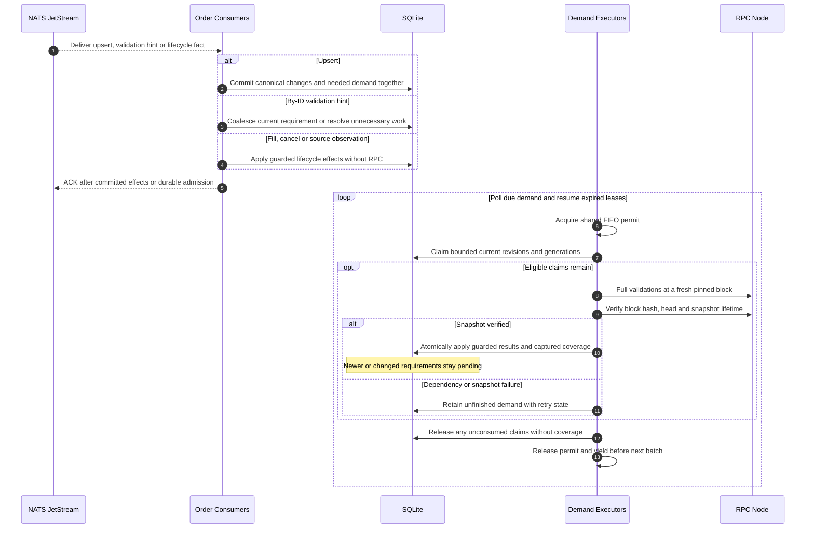
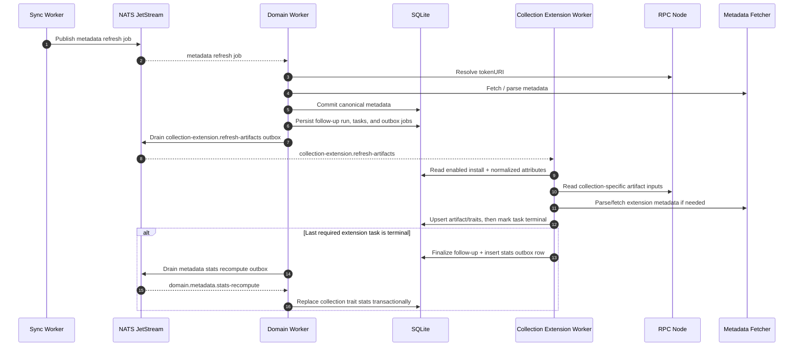
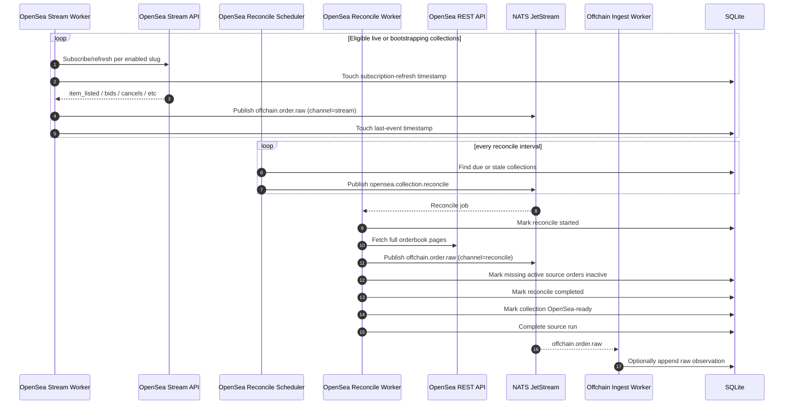

# Sequence Diagrams (High-Level)

These Mermaid diagrams show the current high-level runtime interactions for the indexer and the OpenSea offchain pipeline.

## Realtime Sync + Domain Fanout

```mermaid
sequenceDiagram
    autonumber
    participant RPC as RPC Node (HTTP/WS)
    participant Scheduler as Scheduler Worker
    participant NATS as NATS JetStream
    participant Sync as Sync Worker
    participant DB as SQLite
    participant Domain as Domain Worker

    RPC-->>Scheduler: Head update (WS)
    Scheduler->>RPC: Poll head (HTTP)
    Scheduler->>NATS: Publish realtime and block-check jobs
    NATS-->>Sync: Deliver realtime job
    Sync->>RPC: Fetch logs, extensions, headers, transactions and receipts
    Sync->>DB: Atomic facts, coverage, balances and required follow-up intent
    Sync->>NATS: ACK successful acquisition
    Domain->>DB: Read due required follow-ups
    Domain->>NATS: Publish domain, order and refresh jobs
    Domain->>DB: Remove accepted sync intent; retry failed publication
    NATS-->>Domain: Deliver domain and order jobs
    Domain->>DB: Check event origin hash before admission
    Domain->>DB: Project activities, metadata and orders
```

## Perpetual Collection Gap Repair

```mermaid
sequenceDiagram
    participant Scheduler as Scheduler Worker
    participant DB as SQLite
    participant Sync as Sync Worker Automatic Executor
    participant RPC as RPC Node
    participant Domain as Domain Worker Outbox Drainer
    participant NATS as NATS JetStream

    loop Startup and HTTP head polls, including unchanged heads
        Scheduler->>DB: Page live collections and saved scan progress
        Scheduler->>DB: Stream bounded descending collection coverage
        alt Missing coverage and no pending repair
            Scheduler->>DB: Save cursor and one pending range per collection
        end
    end
    loop Sync startup and periodic bounded passes
        Sync->>DB: Check newest pending height and due HEAD-check times
        Sync->>Sync: Wait for preceding current-state backfill
        Sync->>RPC: Read HEAD when a range or HEAD check is due
        opt Collection HEAD check overdue by 30 minutes
            Sync->>DB: Find newest missing blocks above pending range or cursor
            Sync->>DB: Save check time; replace range/cursor only if newer hole found
        end
        Sync->>DB: Select ready members at newest pending height, LIMIT 16
        Sync->>RPC: Fetch one common suffix for participating collections
        alt Valid acquisition and retained owners
            Sync->>DB: Atomic data, required follow-ups and exact member progress
        else Acquisition or commit failed
            Sync->>DB: Delay only failed member identities
        end
    end
    Domain->>DB: Read retained follow-up intent
    Domain->>NATS: Publish required jobs with stable IDs
    Domain->>DB: Remove accepted intent or retain retry with capped delay
    Note over Scheduler,DB: Completed scans restart at HEAD; saved check time includes downtime
    Note over Sync,DB: Newest retry or above-head range holds older history
    Note over Sync,Domain: Failed publication repeats no RPC acquisition
```

## Durable Reorg Recovery

```mermaid
sequenceDiagram
    participant Reorg as Reorg Worker
    participant RPC as RPC Node
    participant DB as SQLite
    participant Sync as Sync Worker Automatic Executor
    participant Domain as Domain Worker Outbox Drainer
    participant NATS as NATS JetStream

    NATS-->>Reorg: Block-check delivery
    Reorg->>RPC: Fresh header differs from stored hash
    Reorg->>DB: Retain mismatch identity and revision
    alt Retention fails
        Reorg->>NATS: Deferred NACK beyond ordinary retry budget
    else Mismatch retained
        Reorg->>RPC: Complete bounded common-ancestor proof
        alt Proof unavailable
            Reorg->>DB: Retain awaiting_ancestor with delayed retry
        else Verified ancestor
            Reorg->>RPC: ownerOf at exact fork hash, requireCanonical
            Reorg->>DB: Atomic checkpoints, rollback, revision and resync range
        end
        Reorg->>NATS: ACK retained check
    end
    loop Reorg startup and proof polling, independent of HEAD changes
        Reorg->>DB: Read due awaiting_ancestor
        Reorg->>RPC: Retry bounded proof and exact-hash snapshot
    end
    loop Sync startup and periodic automatic passes
        Sync->>DB: Read one retained canonical range and eligible collections
        Sync->>RPC: Acquire canonical range through shared pipeline
        Sync->>DB: Atomic data, required follow-ups and next range or completion
    end
    Domain->>DB: Read independently retained follow-up intent
    Domain->>NATS: Publish stable revision-qualified jobs
    Domain->>DB: Remove accepted intent or retain required retry
    Note over DB,Sync: Failure before commit leaves acquisition pending; after commit publication needs no RPC
    Note over DB,Domain: Rollback keeps DB-range intent and removes orphan event intent; late orphan hints fail admission
```

## Collection Bootstrap + OpenSea Bootstrap

```mermaid
sequenceDiagram
    autonumber
    actor Admin
    participant API as Backend API
    participant Bootstrap as Bootstrap Worker
    participant DB as SQLite
    participant NATS as NATS JetStream
    participant RPC as RPC / metadata HTTP
    participant Ext as Collection Extension Worker
    participant OSBoot as OpenSea Bootstrap Worker
    participant Offchain as Offchain Ingest Worker
    participant Domain as Domain Worker

    Admin->>API: Probe and approve collection scope
    API->>DB: Create run + planned durable steps
    API->>NATS: Publish bootstrap wakeup
    NATS-->>Bootstrap: bootstrap.collection.start

    loop Main and image-cache lane polls
        Bootstrap->>DB: Reconcile dependencies + claim step lease
        alt Anchor
            Bootstrap->>RPC: Read anchor block
            Bootstrap->>DB: Persist anchor
            Bootstrap->>DB: Persist extension install if requested
        else Enumeration
            Bootstrap->>RPC: Resolve approved token scope
            Bootstrap->>DB: Mark enumeration succeeded
            Bootstrap->>DB: Seed metadata tasks in batches
        else Metadata / ownership
            Bootstrap->>RPC: Fetch canonical metadata / ownerOf at anchor
            Bootstrap->>DB: Settle durable tasks + progress
        else Image cache
            Bootstrap->>RPC: Fetch bounded source media
            Bootstrap->>DB: Settle cache task + file record
        else Backfill
            Bootstrap->>DB: Mark delegated step running
            Bootstrap->>NATS: Publish collection-scoped catch-up
        else Collection live
            Bootstrap->>DB: Mark collection live
            Bootstrap->>DB: Mark step succeeded
            Bootstrap->>DB: Mark run completed
            Bootstrap->>DB: Clean eligible successful temporary rows
        end
    end

    par Extension side work after metadata
        Bootstrap->>DB: Seed/observe extension artifact tasks
        Bootstrap->>NATS: Publish collection-extension.refresh-artifacts
        NATS-->>Ext: collection-extension.refresh-artifacts
        Ext->>DB: Claim per-task lease
        Ext->>RPC: Read/render collection-owned artifacts
        Ext->>DB: Upsert artifact/traits
        Ext->>DB: Settle task under the current lease fence
    and OpenSea side work after metadata and ownership
        Bootstrap->>NATS: Publish opensea.collection.bootstrap job
        NATS-->>OSBoot: OpenSea bootstrap job
        OSBoot->>DB: Start collection snapshot run
        OSBoot->>RPC: Fetch OpenSea listing/offer pages
        OSBoot->>NATS: Publish offchain.order.raw snapshot jobs
        OSBoot->>DB: Mark missing source orders inactive
        OSBoot->>DB: Mark collection OpenSea-ready
        OSBoot->>DB: Complete source run
    end

    NATS-->>Offchain: offchain.order.raw
    Offchain->>DB: Optionally record raw observation
    Offchain->>NATS: Publish order work

    NATS-->>Domain: orders.upsert
    Domain->>DB: Commit canonical order and needed validation demand together
    Domain-->>NATS: ACK after commit
```

Validation continues through the local demand loop below; upsert completion
does not publish a second broker envelope or imply validation completion.

## Order Admission and Validation

Consumers and executors here are separate tasks inside the same per-chain
domain-worker process. Lifecycle facts can commit while RPC validation is busy.
Demand, broad-maker and token validation share two FIFO permits. See
[processing ownership](07-domain-orders.md#processing-ownership-and-retained-state)
for the durable state and [ports](12-ports-and-adapters.md#order-processing-ports)
for the application boundaries.

```mermaid
sequenceDiagram
    autonumber
    participant NATS as NATS JetStream
    participant Consumer as Order Consumers
    participant DB as SQLite
    participant Demand as Demand Executors
    participant RPC as RPC Node

    NATS-->>Consumer: Deliver upsert, validation hint or lifecycle fact
    alt Upsert
        Consumer->>DB: Commit canonical changes and needed demand together
    else By-ID validation hint
        Consumer->>DB: Coalesce current requirement or resolve unnecessary work
    else Fill, cancel or source observation
        Consumer->>DB: Apply guarded lifecycle effects without RPC
    end
    Consumer-->>NATS: ACK after committed effects or durable admission

    loop Poll due demand and resume expired leases
        Demand->>Demand: Acquire shared FIFO permit
        Demand->>DB: Claim bounded current revisions and generations
        opt Eligible claims remain
            Demand->>RPC: Full validations at a fresh pinned block
            Demand->>RPC: Verify block hash, head and snapshot lifetime
            alt Snapshot verified
                Demand->>DB: Atomically apply guarded results and captured coverage
                Note over DB: Newer or changed requirements stay pending
            else Dependency or snapshot failure
                Demand->>DB: Retain unfinished demand with retry state
            end
        end
        Demand->>DB: Release any unconsumed claims without coverage
        Demand->>Demand: Release permit and yield before next batch
    end
```

## Maker Checkpoint and Recovery

Each delivery runs one bounded step. The checkpoint owns the atomic boundary
between order effects or handoff, cursor movement and continuation intent.
The outbox publishes afterward; its sent receipt alone is not completion proof.
See [durable maker progress](07-domain-orders.md#durable-maker-progress) for
isolation, follow-up generations, lease fencing and replay cleanup.

```mermaid
sequenceDiagram
    autonumber
    participant NATS as NATS JetStream
    participant Maker as Maker or Token Processor
    participant DB as SQLite
    participant RPC as RPC Node
    participant Outbox as Outbox Publisher
    participant Recovery as Maker Recovery

    NATS-->>Maker: Scoped hint or run/step continuation
    Maker->>DB: Admit or resume finite pass and claim lease
    Maker->>Maker: Acquire shared FIFO permit
    Maker->>RPC: Validate one bounded step at a fresh snapshot
    alt Results verified or isolated handoff available
        alt Successful validation results
            Maker->>RPC: Verify snapshot before committing results
            Maker->>DB: Commit effects, cursor and continuation intent together
        else Persisted isolated candidate read fails again
            Maker->>DB: Commit per-order demand, cursor and continuation intent together
            Note over DB: No failed result becomes validation coverage
        end
    else Shared, snapshot or checkpoint failure
        Maker->>DB: Keep previous cursor and retryable run
    end
    Maker->>Maker: Release permit and lease
    alt Checkpoint committed
        Maker-->>NATS: ACK after durable checkpoint
    else Step failed
        Maker-->>NATS: Delivery fails; saved run retains unfinished work
    end

    opt Scan or newer generation still needs a step
        Outbox->>DB: Read committed continuation
        Outbox->>NATS: Publish next step behind ready work
        Outbox->>DB: Record publication receipt
    end

    loop Bounded recovery and receipt cleanup
        Recovery->>DB: Read idle unfinished runs and delivery receipts
        Recovery->>NATS: Check publication identity and consumer ACK floors
        Recovery->>DB: Repair missing wakeups and reap eligible completed receipts
    end
    Note over DB: Completed maker scan may coexist with pending per-order demand
```

## Canonical Metadata Refresh + Collection Extension Artifacts

```mermaid
sequenceDiagram
    autonumber
    participant Sync as Sync Worker
    participant NATS as NATS JetStream
    participant Domain as Domain Worker
    participant DB as SQLite
    participant Ext as Collection Extension Worker
    participant RPC as RPC Node
    participant MetaHTTP as Metadata Fetcher

    Sync->>NATS: Publish metadata refresh job
    NATS-->>Domain: metadata refresh job
    Domain->>RPC: Resolve tokenURI
    Domain->>MetaHTTP: Fetch / parse metadata
    Domain->>DB: Commit canonical metadata
    Domain->>DB: Persist follow-up run, tasks, and outbox jobs
    Domain->>NATS: Drain collection-extension.refresh-artifacts outbox

    NATS-->>Ext: collection-extension.refresh-artifacts
    Ext->>DB: Read enabled install + normalized attributes
    Ext->>RPC: Read collection-specific artifact inputs
    Ext->>MetaHTTP: Parse/fetch extension metadata if needed
    Ext->>DB: Upsert artifact/traits, then mark task terminal
    alt Last required extension task is terminal
        Ext->>DB: Finalize follow-up + insert stats outbox row
        Domain->>NATS: Drain metadata stats recompute outbox
        NATS-->>Domain: domain.metadata.stats-recompute
        Domain->>DB: Replace collection trait stats transactionally
    end
```

## OpenSea Stream + Reconcile

```mermaid
sequenceDiagram
    autonumber
    participant Stream as OpenSea Stream Worker
    participant OSStream as OpenSea Stream API
    participant ReconcileSched as OpenSea Reconcile Scheduler
    participant Reconcile as OpenSea Reconcile Worker
    participant OSAPI as OpenSea REST API
    participant NATS as NATS JetStream
    participant Offchain as Offchain Ingest Worker
    participant DB as SQLite

    loop Eligible live or bootstrapping collections
        Stream->>OSStream: Subscribe/refresh per enabled slug
        Stream->>DB: Touch subscription-refresh timestamp
        OSStream-->>Stream: item_listed / bids / cancels / etc
        Stream->>NATS: Publish offchain.order.raw (channel=stream)
        Stream->>DB: Touch last-event timestamp
    end

    loop every reconcile interval
        ReconcileSched->>DB: Find due or stale collections
        ReconcileSched->>NATS: Publish opensea.collection.reconcile
    end

    NATS-->>Reconcile: Reconcile job
    Reconcile->>DB: Mark reconcile started
    Reconcile->>OSAPI: Fetch full orderbook pages
    Reconcile->>NATS: Publish offchain.order.raw (channel=reconcile)
    Reconcile->>DB: Mark missing active source orders inactive
    Reconcile->>DB: Mark reconcile completed
    Reconcile->>DB: Mark collection OpenSea-ready
    Reconcile->>DB: Complete source run

    NATS-->>Offchain: offchain.order.raw
    Offchain->>DB: Optionally append raw observation
```
