# ArtGod Operator Guide

First of all, thank you for trying ArtGod. You are part of the first public cohort: before the open-source alpha, the app had not been tested by outside users.

Please keep in mind that this is alpha software. That does not mean nothing should work, but you should expect rough edges, bugs, slow workflows, unsupported collections, and behavior that may change between releases.

The best way to use ArtGod right now is to start small and expand gradually. Bootstrap one collection, learn how its data behaves, and only then try bidding. For your first bid, use a very small amount and treat it as a real live OpenSea offer—not a simulated test order.

Use a dedicated bidding wallet funded only with the WETH and ETH you are prepared to expose to alpha software. Do not use a valuable main wallet.

## A Full Step-by-Step Guide

1. Verify the downloaded ArtGod release using the instructions in the README.

    Start with the [Release Key section in the README](../../README.md#release-key),
    which contains the current key fingerprints and leads into the canonical
    verification commands. The following examples show successful verification
    runs. Before trusting the included release key, compare its primary and
    active release-signing-subkey fingerprints with separately published copies
    in more than one of these locations:
    - [ArtGod's X account](https://x.com/artgod_eth)
    - [ArtGod's official website](https://artgod.network)
    - [the `d347h-eth` GitHub profile](https://github.com/d347h-eth)
    - [the `artgod.eth` ENS text records](https://app.ens.domains/artgod.eth?tab=records)

    Filenames, versions, signature timestamps, and shell prompts can differ.
    `Good signature` confirms that the files were signed by the imported key;
    trust the key only after both displayed fingerprints exactly match the
    independently published ArtGod fingerprints. GPG's `[unknown]` trust label
    and uncertified-key warning are expected when the release key has not been
    personally certified in the local GPG trust database.

    Linux:

    ```text
    $ ls -1
    ArtGod_0.1.1-alpha.3_amd64.AppImage
    ArtGod_0.1.1-alpha.3_amd64.AppImage.asc
    ArtGod_0.1.1-alpha.3_amd64.deb
    ArtGod_0.1.1-alpha.3_amd64.deb.asc
    artgod-release-public.asc
    SHA256SUMS.txt
    SHA256SUMS.txt.asc
    $ gpg --show-keys --with-fingerprint --with-subkey-fingerprint artgod-release-public.asc
    pub   ed25519 2026-07-08 [C] [expires: 2028-07-07]
          2528 300C 396A FEDF 0626  1962 6E5E 8A9B C0EC D353
    uid                      ArtGod Release Primary (artgod.eth)
    sub   ed25519 2026-07-09 [S] [expires: 2027-07-09]
          6ED7 A348 14FF F8BB AB94  784A A4EE 961C BD9F 14AD

    $ gpg --import artgod-release-public.asc
    gpg: key 6E5E8A9BC0ECD353: public key "ArtGod Release Primary (artgod.eth)" imported
    gpg: Total number processed: 1
    gpg:               imported: 1
    $ gpg --verify SHA256SUMS.txt.asc SHA256SUMS.txt
    gpg: Signature made Tue 14 Jul 2026 04:14:43 CEST
    gpg:                using EDDSA key 6ED7A34814FFF8BBAB94784AA4EE961CBD9F14AD
    gpg: Good signature from "ArtGod Release Primary (artgod.eth)" [unknown]
    gpg: WARNING: This key is not certified with a trusted signature!
    gpg:          There is no indication that the signature belongs to the owner.
    Primary key fingerprint: 2528 300C 396A FEDF 0626  1962 6E5E 8A9B C0EC D353
         Subkey fingerprint: 6ED7 A348 14FF F8BB AB94  784A A4EE 961C BD9F 14AD
    $ sha256sum --ignore-missing --check SHA256SUMS.txt
    ./ArtGod_0.1.1-alpha.3_amd64.AppImage: OK
    ./ArtGod_0.1.1-alpha.3_amd64.AppImage.asc: OK
    ./ArtGod_0.1.1-alpha.3_amd64.deb: OK
    ./ArtGod_0.1.1-alpha.3_amd64.deb.asc: OK
    ./artgod-release-public.asc: OK
    $ gpg --verify "ArtGod_0.1.1-alpha.3_amd64.AppImage.asc" "ArtGod_0.1.1-alpha.3_amd64.AppImage"
    gpg: Signature made Tue 14 Jul 2026 04:08:56 CEST
    gpg:                using EDDSA key 6ED7A34814FFF8BBAB94784AA4EE961CBD9F14AD
    gpg: Good signature from "ArtGod Release Primary (artgod.eth)" [unknown]
    gpg: WARNING: This key is not certified with a trusted signature!
    gpg:          There is no indication that the signature belongs to the owner.
    Primary key fingerprint: 2528 300C 396A FEDF 0626  1962 6E5E 8A9B C0EC D353
         Subkey fingerprint: 6ED7 A348 14FF F8BB AB94  784A A4EE 961C BD9F 14AD
    $ gpg --verify "ArtGod_0.1.1-alpha.3_amd64.deb.asc" "ArtGod_0.1.1-alpha.3_amd64.deb"
    gpg: Signature made Tue 14 Jul 2026 04:08:58 CEST
    gpg:                using EDDSA key 6ED7A34814FFF8BBAB94784AA4EE961CBD9F14AD
    gpg: Good signature from "ArtGod Release Primary (artgod.eth)" [unknown]
    gpg: WARNING: This key is not certified with a trusted signature!
    gpg:          There is no indication that the signature belongs to the owner.
    Primary key fingerprint: 2528 300C 396A FEDF 0626  1962 6E5E 8A9B C0EC D353
         Subkey fingerprint: 6ED7 A348 14FF F8BB AB94  784A A4EE 961C BD9F 14AD
    ```

    macOS:

    ```text
    % ls -1
    ArtGod_0.1.1-alpha.3_universal.dmg
    artgod-release-public.asc
    SHA256SUMS.txt
    SHA256SUMS.txt.asc
    % gpg --show-keys --with-fingerprint --with-subkey-fingerprint artgod-release-public.asc
    pub   ed25519 2026-07-08 [C] [expires: 2028-07-07]
          2528 300C 396A FEDF 0626  1962 6E5E 8A9B C0EC D353
    uid                      ArtGod Release Primary (artgod.eth)
    sub   ed25519 2026-07-09 [S] [expires: 2027-07-09]
          6ED7 A348 14FF F8BB AB94  784A A4EE 961C BD9F 14AD

    % gpg --import artgod-release-public.asc
    gpg: key 6E5E8A9BC0ECD353: public key "ArtGod Release Primary (artgod.eth)" imported
    gpg: Total number processed: 1
    gpg:               imported: 1
    % gpg --verify SHA256SUMS.txt.asc SHA256SUMS.txt
    gpg: Signature made Tue Jul 14 04:14:43 2026 CEST
    gpg:                using EDDSA key 6ED7A34814FFF8BBAB94784AA4EE961CBD9F14AD
    gpg: Good signature from "ArtGod Release Primary (artgod.eth)" [unknown]
    gpg: WARNING: This key is not certified with a trusted signature!
    gpg:          There is no indication that the signature belongs to the owner.
    Primary key fingerprint: 2528 300C 396A FEDF 0626  1962 6E5E 8A9B C0EC D353
         Subkey fingerprint: 6ED7 A348 14FF F8BB AB94  784A A4EE 961C BD9F 14AD
    % shasum -a 256 --ignore-missing --check SHA256SUMS.txt
    ./ArtGod_0.1.1-alpha.3_universal.dmg: OK
    ./artgod-release-public.asc: OK
    ```

2. Open Admin Config and source and benchmark the RPC endpoints you want to use.

    Before RPC sourcing and benchmarking:

    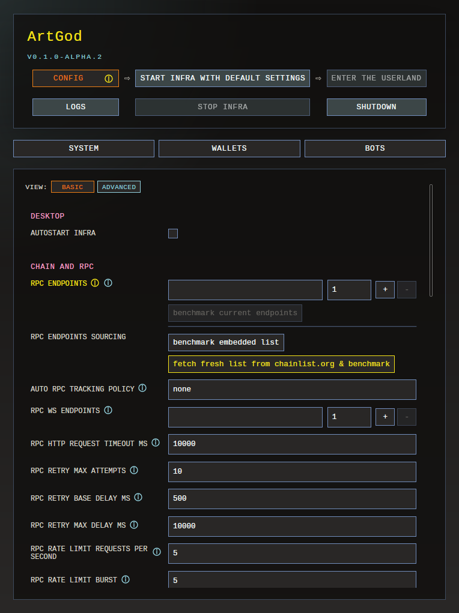

    After RPC sourcing and benchmarking:

    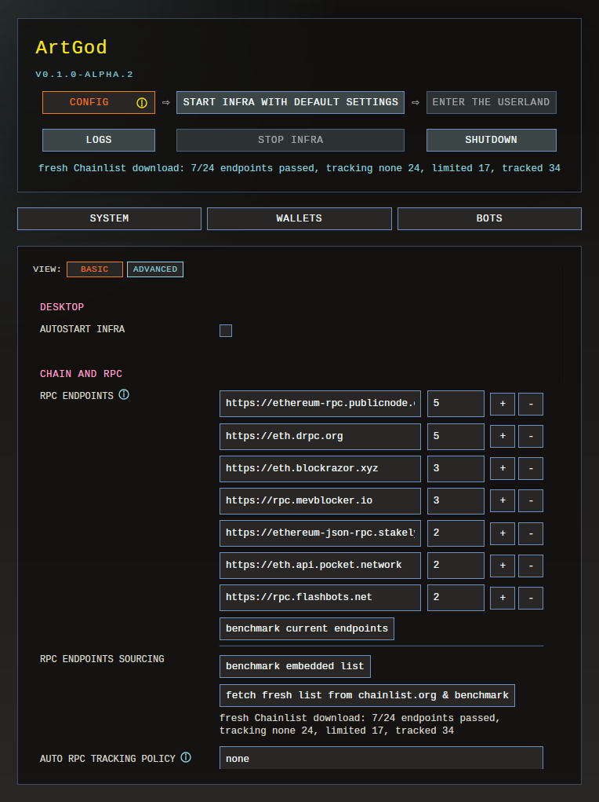

3. Add your OpenSea credentials, review the trading and bidding settings, and set **WETH allowance cap** to a non-zero value so bidding jobs can execute. Start with a small cap while trying the app, then save the configuration.

    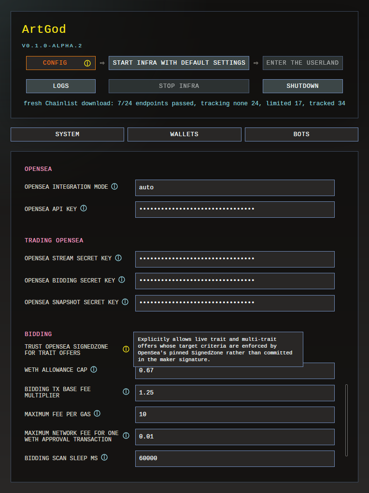

4. Start the infrastructure. After it starts successfully, select **Enter the Userland**.

    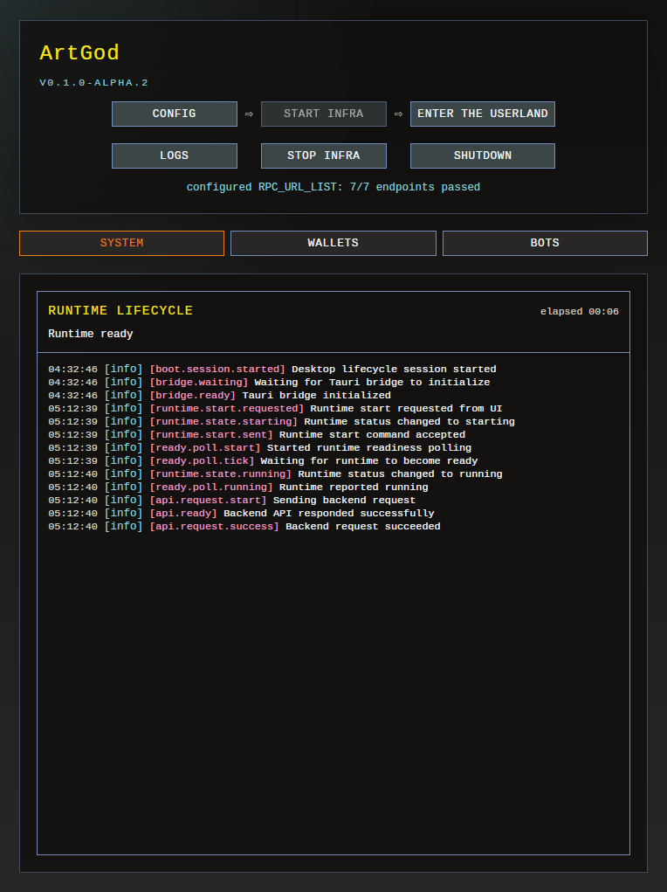

5. Bootstrap one collection. Confirm that its contract source is publicly verified, review the detected contract capabilities, complete the bootstrap settings, and queue the bootstrap.

    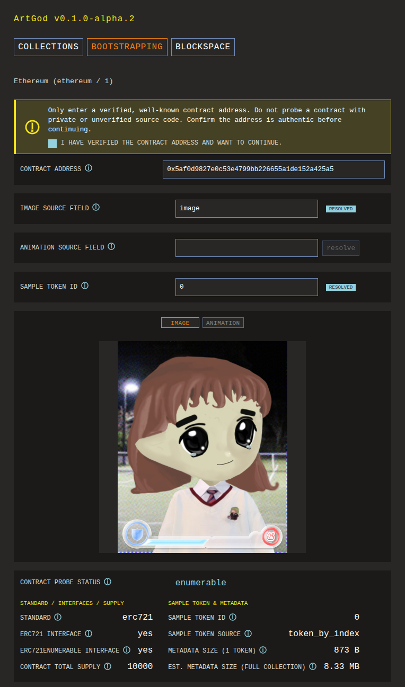

    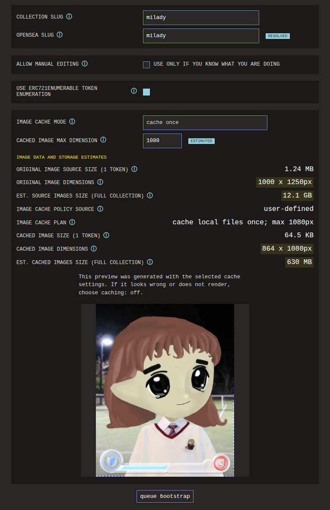

6. While the collection bootstrap runs, import a dedicated bidding wallet in Admin.

    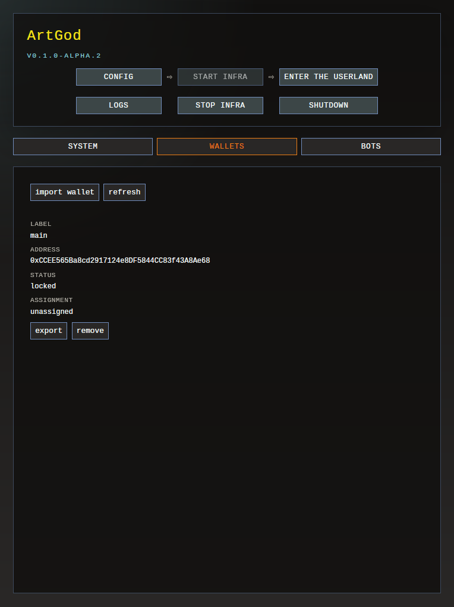

7. Open Admin Bots, select the dedicated wallet, and use **Apply wallet** to assign it to the bot.

    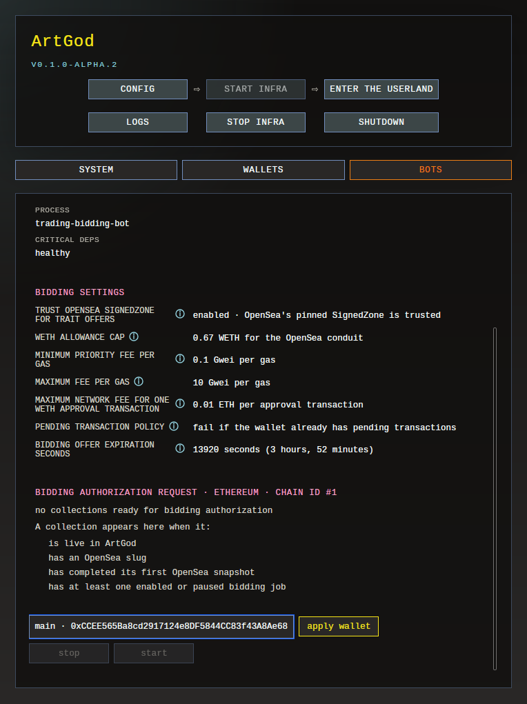

8. Before bidding, wait until the collection is `live` and its initial OpenSea snapshot is complete. Its image cache can continue after these are ready.

    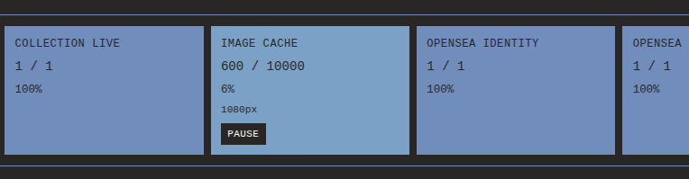

9. ArtGod includes keyboard shortcuts. Open the cheatsheet with the `?` button in the top-right corner or press `F1`.

    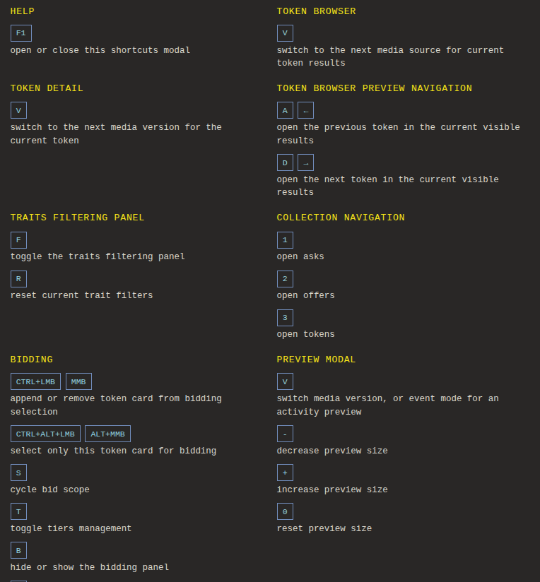

10. In Userland, select one NFT as the target for your first bid.

    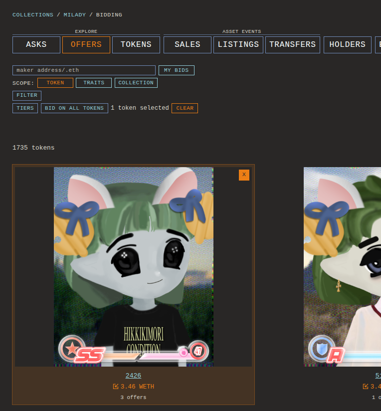

11. Create the first bidding job with a small amount to see how bidding execution works. Keep its **Ceiling ETH** at or below the **WETH allowance cap** saved in Admin Config.

    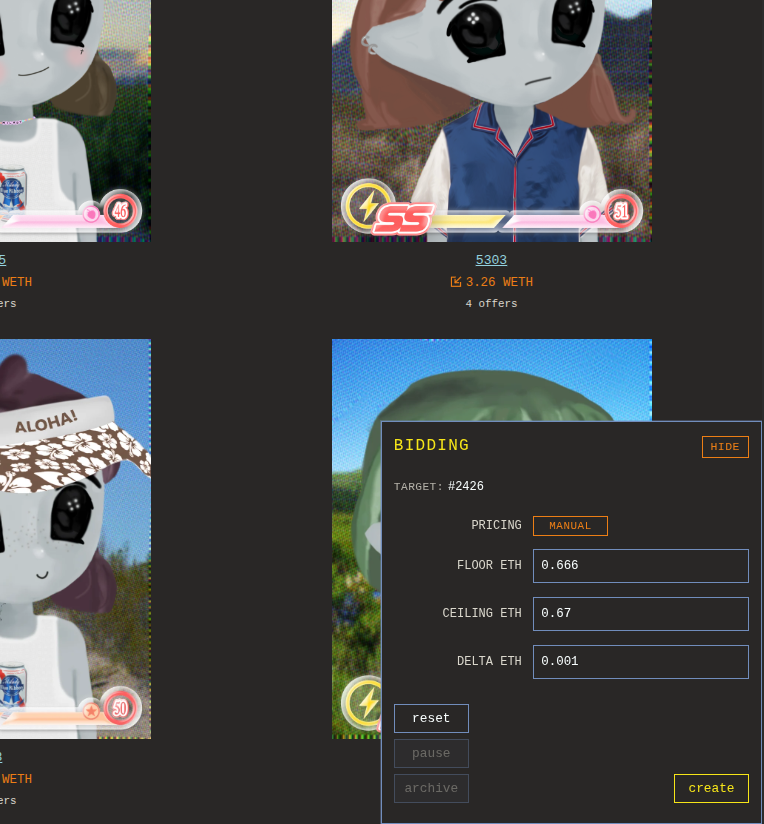

12. After creating the first bidding job, return to Admin and refresh the **Bots** page to load the bidding authorization request. Review its limits, select the assigned wallet, and start the bot.

    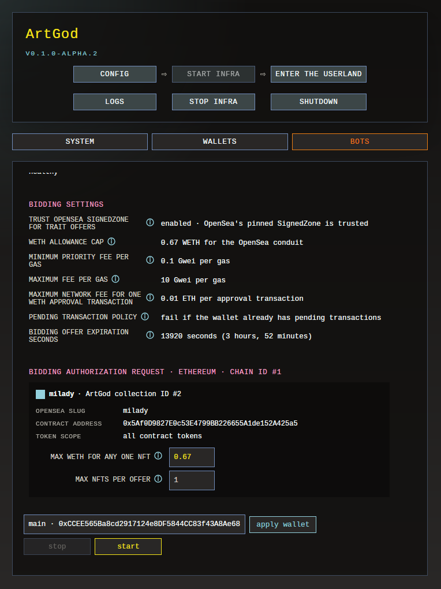

13. Confirm that the offer appears as expected. While the bot is still active, pause or archive the job and confirm that the offer is cancelled.

Stopping the bot is not the same as cancelling its offers. Existing signed OpenSea orders and the onchain WETH allowance can remain after the bot stops. Always verify cancellation separately.

## Why Collections Behave Differently

Every NFT collection is different.

Some collections cannot be bootstrapped automatically yet. ArtGod currently works best with enumerable ERC-721 collections. Contracts without reliable token enumeration, unusual token scopes, unexpected proxy behavior, or nonstandard metadata may need support that is not implemented yet.

Metadata can be stored inline, onchain, behind an IPFS gateway, or on an ordinary HTTP server. Any external source can be slow, rate-limited, malformed, temporarily unavailable, or gone for good. ArtGod uses bounded retries, but it cannot recover data that no longer exists.

A collection becoming `live` means its local ownership state and realtime onchain sync are ready. It does not necessarily mean that its OpenSea snapshot, image cache, or collection-specific artifacts have finished.

Bidding behavior also varies by collection. Some collections receive far more offers and marketplace events than others, and their complete offer books may be many times larger. ArtGod coalesces repeated events and applies backpressure so a busy collection cannot completely monopolize the bot, but large order books still take longer to snapshot, verify, and process.

Start with one collection bootstrap at a time. Multiple runs share the same RPC pool and bounded worker lanes, so starting more work usually increases total completion time instead of making everything finish in parallel.

## OpenSea API Key

ArtGod currently uses OpenSea for collection lookup, offchain listings and offers, marketplace event streams, and bidding.

Get an API key from [OpenSea Developer settings](https://opensea.io/settings/developer).

ArtGod has four OpenSea credential fields:

- `OPENSEA_API_KEY` for collection lookup and the main indexer's OpenSea snapshots, streams, and reconciliation
- `OPENSEA_STREAM_SECRET_KEY` for bidding-bot stream events
- `OPENSEA_BIDDING_SECRET_KEY` for the bot's OpenSea reads, offer placement, and cancellation
- `OPENSEA_SNAPSHOT_SECRET_KEY` for the bot's collection-offer snapshots

You can enter the same value in all four fields. All four fields must be filled before bidding can start, even if they contain the same key.
The entire composition can work with the same key or with keys from the same OpenSea account. But if your demand grows, you will eventually pass a threshold where a single key won't be enough.

Never include API keys in screenshots, logs, or feedback reports.

## Bidding Bot Operation

The bot performs several kinds of work:

- full scans over enabled bidding jobs
- immediate handling of committed Userland commands
- targeted refreshes triggered by relevant OpenSea events
- collection-offer snapshot polling and active-order verification

After a full job scan finishes, the bot waits 60 seconds by default before starting the next one (`BIDDING_SCAN_SLEEP_MS`). This is the delay between full passes, not a guaranteed reaction time for every job.

Relevant OpenSea events can wake the bot between full scans. ArtGod coalesces repeated event signals so a busy collection cannot monopolize processing. Userland commands receive priority over background OpenSea work, although operations for the same job still happen one at a time.

To start the bidding bot, ArtGod needs:

- healthy core infrastructure
- OpenSea integration and bidding enabled
- all required OpenSea credential fields filled
- an assigned bidding wallet
- at least one eligible collection selected
- at least one enabled or paused bidding job for that collection

An eligible collection must be `live`, have an OpenSea slug, and have completed its initial OpenSea snapshot at least once.

### Bidding Authorization

Every bot start includes a native bidding-authorization review. It freezes the following values for that bot run:

- chain identity
- exact WETH allowance for the OpenSea conduit
- WETH-approval fee and pending-transaction policy
- whether OpenSea SignedZone is trusted for trait offers
- the exact identity of each selected collection
- the maximum WETH allowed for any one NFT
- the current one-NFT-per-offer quantity limit

These are per-offer safety limits. They are not a cumulative spending budget across all jobs and open orders.

To change the active authorization, stop the bot and start it again. Every start requires a fresh review and wallet unlock. Existing OpenSea orders and the onchain WETH allowance are not automatically removed when the bot stops.

### Trait Bidding

Live trait and multi-trait bidding is disabled by default.

Enable `trust OpenSea SignedZone for trait offers` only after reading its help text and accepting that OpenSea's pinned SignedZone enforces the exact trait criteria. Save the setting, restart infra, and review that trust decision again when starting the bot.

### WETH Allowance Cap

`WETH allowance cap` is the exact onchain allowance ArtGod reconciles for the OpenSea conduit. It is not a cumulative bidding budget.

The default value is `0`. During a normal live bot start:

- if the current allowance is already zero, no approval transaction is needed
- if the current allowance is nonzero, ArtGod submits a transaction to revoke it
- if you configure a nonzero value, ArtGod reconciles the allowance to exactly that value

The wallet needs enough ETH to pay for any approval or revocation transaction. Keep the configured allowance and the wallet's WETH balance as small as is practical for what you are testing.

### Startup and Response Time

The bot starts in a `bootstrapping` phase. Before becoming active, it reconciles the WETH allowance, refreshes authoritative collection snapshots, warms current prices for token jobs, and replays pending commands.

Startup time depends on the number and size of collection order books, the number of token jobs, OpenSea and RPC latency, rate limits, and retries. A large setup can take several minutes, but raw job count alone is not a useful estimate.

Once the bot is active, Userland changes should normally be picked up without waiting for the next full scan. ArtGod sends an immediate wake-up signal and also checks for missed commands. Earlier commands, work on the same job, rate limits, and network delays can still add latency.

## Choosing RPC Settings

On the first infrastructure launch with no RPC endpoints configured, ArtGod automatically benchmarks its internally embedded list of public Ethereum RPC endpoints and saves the endpoints that pass. This lets you get started without sourcing endpoints manually.

For a more gradual or refined setup, open the Config tab before that first launch. The `RPC endpoints sourcing` controls let you benchmark the embedded list or fetch a fresh list from Chainlist and benchmark it. The `auto RPC tracking policy` setting controls which tracking levels the automated sourcing may include.

ArtGod checks every configured RPC endpoint before starting. At least one must pass, but there is no magic endpoint count.

The benchmark assigns initial weights based on response time. During operation, ArtGod reduces an endpoint's effective weight after relevant failures and gradually restores it after successful requests.

A passing benchmark only confirms that the endpoint answered the basic recent block calls ArtGod tested. It does not prove that the endpoint is truthful, archival, independent, or suitable for sustained load. ArtGod treats every configured RPC endpoint as a trusted source of chain state.

### Public RPC Endpoints

- Prefer several successful endpoints from independent operators over a long list of URLs backed by the same provider.
- Start with the default RPC rate-limit values: 5 requests per second and a burst of 5.
- Do not raise those limits because an endpoint passed one benchmark. Public provider limits can change, and aggressive settings may cause throttling or temporary bans.
- Start one collection bootstrap at a time.
- `auto RPC tracking policy` only filters endpoints automatically selected from Chainlist. It does not anonymize your traffic, verify the provider's claims, or inspect endpoints you entered manually.

### Hosted Endpoints With an API Key or Free Tier

- Follow the provider's documented quota and start below it.
- Additional URLs only provide additional capacity when the provider actually gives them independent quotas.
- `RPC rate limit requests per second` controls sustained traffic.
- `RPC rate limit burst` controls how many requests may pass immediately before the limiter has to wait for refill.
- Keep `backfill worker count` at `1` for normal bootstrap use. Raising it does not speed up bootstrap's ordered catch-up phase.

### A Self-Hosted RPC Node

Even a personal node is not truly unlimited. CPU, memory, disk speed, database state, and RPC implementation all matter.

Leave throttling enabled until you have measured the node under ArtGod's real workload. Setting `RPC rate limit requests per second` to `0` disables ArtGod's RPC limiter. While it is disabled, the burst setting has no effect.

Only increase worker concurrency after checking ArtGod's logs and observability data.

## Metadata and Media Expectations

ArtGod currently supports HTTP(S), inline `data:` metadata, and `ipfs://` through the configured IPFS gateway. Raw `ar://` URIs are not supported yet, although `https://arweave.net/...` URLs work as ordinary HTTP.

Local image caching runs separately and may continue after the collection is already live. Individual image tasks can fail without invalidating the collection's canonical metadata or ownership state.

During current alpha testing, some public gateway URLs have been slow or rate-limited, and some collections have had much heavier media than metadata. Treat these as dated observations, not permanent rankings of storage platforms. Provider behavior can change at any time.

## Sending Feedback

Please write down anything unexpected, confusing, slow, or unsatisfying. You can [open an issue on GitHub](https://github.com/d347h-eth/artgod/issues) or [send ArtGod a direct message on X](https://x.com/artgod_eth). Feedback from the first public users is crucial and very much appreciated.

A useful report includes:

- ArtGod version and operating system
- collection name and contract address
- what you were trying to do
- what you expected to happen
- what actually happened
- approximate time of the problem
- visible collection or bot state
- relevant screenshots and logs

Never send a wallet private key, seed phrase, wallet passphrase, OpenSea API key, or another secret. Check screenshots and copied configuration before sharing them.

You may contact ArtGod by direct message, but ArtGod will never initiate a support DM or ask for private keys, seed phrases, wallet passphrases, API keys, payments, or remote access. Treat anyone who does as an impersonator.
